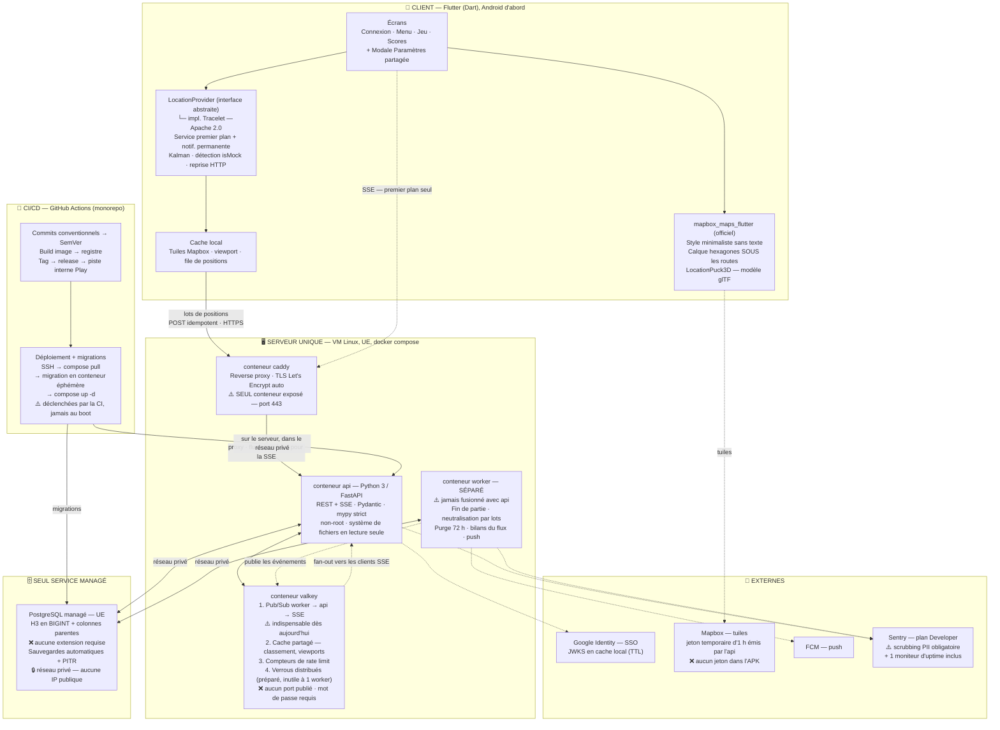

# Arpendo — Document de cadrage

> **À lire intégralement au démarrage d'une session.**
> Ce document remplace `CADRAGE-HEXA-WORLD.md`, qui contenait des décisions désormais périmées
> (voir §18, journal des changements).
>
> **État au 13 août 2026 :** **toutes les sections sont closes**, section 13 (étude technique)
> et chiffrage compris. La **phase UX a eu lieu** — voir `02-specification-ux.md`, qui tranche
> les points que §15 laissait ouverts. Elle a produit trois corrections, toutes arbitrées et
> intégrées (journal §18.2) : quatrième niveau de permissions (§9.3), coût réel des motifs (§5.2),
> retour visible du plafond de vitesse (§4.3).
> La **phase d'identité visuelle a eu lieu** — voir `03-identite-visuelle.md`, direction
> **« Relevé »** retenue, valeurs intégrées dans la spec UX et ici (journal §18.3).
> La **passe de ton** sur les textes de la spécification est faite (journal §18.5). Reste à produire :
> le **PDF de spécification** (§17).
>
> **Architecture d'hébergement arrêtée :** un **serveur unique en UE**, tout en **conteneurs
> Docker** (`caddy`, `api`, `worker`, `valkey`), plus **un seul service managé : PostgreSQL**.
> **25,82 € HT / mois** au MVP. Détail, sources et scénarios de montée en charge dans
> `04-chiffrage.md`.
>
> Objectif final : produire un PDF de spécification complète du projet, de bout en bout
> (produit, technique, hébergement, coûts, planning, risques).

---

## 1. Identité du projet

| Élément | Valeur |
|---|---|
| Nom | **Arpendo** |
| Accroche | **« prends du terrain »** |
| Identifiant de package | **`com.arpendo.game`** — définitif sur Google Play, jamais modifiable après la première publication |
| Vérification marque | TMview, 30 août 2026 : **aucune marque « Arpendo » n'existe.** Six enregistrements voisins, dont **trois vivants sous deux noms** — « Carpendo » (Sellbee GmbH, EUIPO + Royaume-Uni, **classe 35 seule**) et « Harpendore » (UK00003105925, **classes 9 et 41 comprises**). Aucun n'est identique ; seul « Harpendore » couvre nos classes, et seulement au Royaume-Uni. Non bloquant. À réévaluer avant tout dépôt réel |
| Dépôt de marque | Non fait, non urgent (~190 € INPI 1 classe, ~850 € EUIPO). Classes pertinentes : 9 (logiciels) et 41 (jeux) |
| **Identité visuelle** | **Direction « Relevé », retenue le 13 août 2026.** Accent `#123D1E` (vert forêt), typographie Roboto (0 octet d'APK), signe = courbes de niveau refermées sur un hexagone. Produite dans `03-identite-visuelle.md`, intégrée dans `02-specification-ux.md` §1.2, §1.5, §1.6, §3.4.1 et §4 |
| **Cible Android** | **Android 8.0 (API 26) minimum** — `minSdk = 26` dans `app/android/app/build.gradle.kts`. Décidé le 26 août 2026 (#50) : un seul adaptive icon vectoriel, aucun `mipmap` PNG ; aucune dépendance n'exige davantage |

L'accroche est une chaîne traduisible : elle vit dans le fichier de ressources, jamais en dur.
Elle sert à trois endroits : fiche Play Store, écran de connexion, partage de lien (post-MVP).

---

## 2. Le concept

Jeu mobile de conquête territoriale en géolocalisation réelle, façon « Turf / Splatoon IRL ».

- Les joueurs créent une **partie** et invitent d'autres joueurs via un **code**.
- Le créateur choisit la **durée** : 30 min / 1 h / 2 h / 4 h / 24 h / 48 h / 1 semaine / 1 mois.
- La carte est une **carte du monde vue du dessus** (moteur Mapbox), recouverte d'une grille **H3 résolution 10**.
- Marcher sur un hexagone le fait passer à **sa couleur** : il rapporte **100 points**.
- Les hexagones adverses sont **volables** en marchant dessus, avec un temps de recharge par joueur.
- Tous les joueurs d'une partie voient l'état du territoire en temps réel.
- Le déplacement est **réel** : le personnage suit les coordonnées GPS (façon Pokémon Go).

**Intention produit :** le jeu vise des joueurs **à distance, qui ne se croisent pas souvent**.
L'enjeu est de voir qui explore le plus le monde, pas de se chasser mutuellement.
Cette intention justifie plusieurs décisions de conception (verrou de vol, absence de position continue).

### Exigences de qualité posées par le porteur du projet

- Code **modulaire, générique, organisé, structuré**, clair, cohérent, maintenable.
- Aucun code dupliqué, inutile ou obsolète. Séparation stricte des responsabilités.
- Principes **KISS, DRY, YAGNI**. Code propre, concis, optimisé.
- Projet **robuste et très sécurisé**.
- MVP volontairement **petit**, mais irréprochable sur la sécurité et la logique.

> **Principe d'arbitrage appliqué tout au long du cadrage :** la simplicité gagne par défaut.
> Toute complexité doit être argumentée pour être acceptée.
> YAGNI s'applique aux **fonctionnalités**, pas aux **verrouillages d'architecture** :
> ce qui est irréversible ou coûteux à rétrofitter est préparé dès maintenant (§12).

---

## 3. Contexte projet

| Sujet | Décision |
|---|---|
| Qui développe | Le porteur du projet, assisté par l'IA (Claude Code) |
| Budget infra accepté | 50 à 150 € / mois avant revenus |
| Plateformes | **Android d'abord**, iOS dans un second temps |
| Échelle de départ | Moins de 50 joueurs, mais **architecture prévue pour scaler fort** |
| Objectif du MVP | **Base d'un vrai produit commercial** (fondations non jetables) |
| Monétisation | Aucune au MVP, sujet repoussé |
| RGPD | **Conforme dès le départ** |
| Temps disponible | **Moins de 8 h / semaine** |
| Design / UI-UX | **Explicitement repoussé** à une phase ultérieure |
| Langues | **Français seul au MVP**, architecture i18n complète dès le jour 1 |

> ⚠️ **Tension à arbitrer dans le PDF final :** « produit commercial » + « conforme RGPD » +
> « scalable » avec moins de 8 h/semaine place le MVP à **6-9 mois calendaires**.
> Une variante à périmètre réduit (~3 mois) doit être proposée.

---

## 4. Règles du jeu

### 4.1 Fondamentaux

| Sujet | Décision |
|---|---|
| Taille d'hexagone | **H3 résolution 10** (~130 m de large, ~15 000 m²) |
| Capture | Instantanée en marchant dessus |
| Capture de tuile neutre | **Illimitée**, aucun temps de recharge |
| Score | **100 × nombre d'hexagones possédés à l'instant T** |
| Zone de jeu | **Monde entier**, aucune limite géographique |
| Victoire | Le plus de points au moment où la partie se termine |
| Parties simultanées | **Une seule partie active par joueur** |
| Rejoindre en cours | **Oui**, le code reste valide après le démarrage |
| Hexagone de départ | **Capturé immédiatement** à l'arrivée en partie, s'il est capturable |
| Nombre de joueurs | **10 maximum, en dur.** Aucun paramètre ni curseur à la création. Limite = taille de palette (§5.2) |

**Sur le score :** d'autres sources de points viendront après le MVP → l'architecture doit le permettre.

> ⚠️ **Conséquence à assumer et à rendre lisible dans l'UI :** le score étant la possession
> à l'instant T, il **peut baisser pendant que le joueur dort**. Ce n'est pas un défaut mais un
> choix de conception. L'interface doit montrer que le score est *vivant*, pas *acquis*,
> sinon la baisse passera pour un bug.

### 4.2 Vol de tuiles

Le vol est **toujours possible**, indépendamment de la présence ou de l'absence du propriétaire.
Un joueur absent n'a **aucune protection** — sinon la meilleure stratégie du jeu deviendrait
« capturer beaucoup puis quitter », ce qui tuerait le jeu.

**Verrou par joueur (et non par tuile) :** un joueur ne peut voler une tuile déjà possédée
qu'une fois par période de recharge. Ce choix rend la traque **non rentable** : pendant la recharge,
le joueur traqué a le temps de capturer plus d'une tuile neuve.

| Durée de partie | Verrou de vol | Vols max théoriques |
|---|---|---|
| 30 min | 1 min | 30 |
| 1 h | 1 min | 60 |
| 2 h | 2 min | 60 |
| 4 h | 2 min | 120 |
| 24 h | 5 min | 288 |
| 48 h | 5 min | 576 |
| 1 semaine | 5 min | 2 016 |
| 1 mois | 5 min | 8 640 |

**Implémentation :** colonne `steal_cooldown_seconds` sur la partie, figée à la création.
Horodatage `last_steal_at` sur la participation du joueur — une valeur, pas un verrou par tuile.
Le client reçoit la valeur et affiche un **compte à rebours visible** : sans lui, marcher sur une
tuile adverse sans rien obtenir passera pour un bug.

**Cohérence hors ligne :** le serveur applique le verrou dans l'ordre chronologique en rejouant
le trajet. Le client applique la même règle en local, sinon il colore plusieurs tuiles puis
en décolore.

**Note :** ce mécanisme remplace l'ancien « verrou de 5 min sur la tuile fraîchement capturée ».
Conséquence documentée : deux joueurs proches peuvent se reprendre une tuile alternativement.
Acceptable.

### 4.3 Plafond de vitesse

**50 km/h.** Au-delà, la position est **reçue mais ne capture rien**. Le joueur n'est ni bloqué,
ni déconnecté : il traverse sans prendre de tuiles.

- Calcul **côté serveur** uniquement, sur les positions validées.
- **Moyenne glissante sur les 3 dernières positions**, jamais sur un écart isolé : le GPS urbain
  dérive (sauts de 50 m entre immeubles) et simulerait des pics de vitesse sur un joueur immobile.
- **Effet réel, formulé honnêtement** : marche, course et vélo passent sans difficulté ;
  **route, autoroute et train sont exclus**. La **conduite urbaine (30-50 km/h) reste possible** —
  c'est assumé : elle capture lentement et ne dénature pas le jeu.
- **Intention du garde-fou** : empêcher qu'on capture ~1 500 tuiles depuis un TGV sans bouger de
  son siège. Il ne s'agit pas de policer les modes de déplacement. Descendre le seuil créerait
  surtout des faux positifs pénibles (cycliste en descente, joggeur au GPS qui dérive).

**Retour visible au joueur — ajouté le 12 août 2026.** Pendant le dépassement, le client affiche,
via le **composant de bandeau unique** de §9.3 : **« Trop vite : tes pas ne comptent pas. »**

- **Motif :** c'est exactement le raisonnement qui a justifié le compte à rebours du verrou de vol
  en §4.2 — *« sans lui, marcher sur une tuile adverse sans rien obtenir passera pour un bug »*.
  La phrase s'applique mot pour mot à un joueur qui traverse des hexagones sans en prendre aucun.
  Le §4.3 initial décrivait l'effet et omettait de le dire au joueur.
- **Le calcul reste exclusivement côté serveur.** Le client ne recalcule rien : il **reçoit un
  drapeau** dans la réponse aux lots de positions et se contente de l'afficher. Aucune règle n'est
  déplacée côté client, donc aucune ouverture anti-triche (§12.5).
- **Double condition d'affichage** : vitesse au-dessus du seuil **et** traversée d'hexagones
  capturables. Afficher le message à un passager de train qui survole des hexagones neutres qu'il
  ne voulait pas prendre serait une nuisance ; il n'a de sens que quand le joueur perd réellement
  quelque chose.
- **Coût :** un booléen dans la réponse serveur. Le composant d'affichage existe déjà et est
  partagé avec le compte à rebours du verrou de vol — même besoin, expliquer une action sans effet,
  donc un seul composant (§7.3 de `02-specification-ux.md`).
- **Ce que cela ne change pas :** l'intention affichée du garde-fou. Expliquer sans bloquer sert
  le « il ne s'agit pas de policer les modes de déplacement » plutôt qu'il ne le contredit. Un
  cycliste en descente verra brièvement le message et en comprendra la raison — ce qui vaut mieux
  que de ne rien comprendre.

Ceci **remplace** l'ancienne décision « tous les modes de déplacement autorisés, aucune limite de vitesse ».

### 4.4 Quitter une partie

**Départ définitif et irréversible.**

- Les hexagones du joueur sont **neutralisés** (ils redeviennent libres pour tous).
- Le joueur est **retiré du classement**.
- Il peut ensuite rejoindre à nouveau, mais **comme un nouveau joueur, à zéro** ;
  sa couleur a été libérée entre-temps.

**Contraintes d'implémentation :**

- **Double confirmation obligatoire**, avec le mot « définitivement » et le décompte affiché
  (« Tu laisses 1 247 hexagones derrière toi. Ils redeviennent libres, et tu ne les récupéreras
  pas. »).
  Sans cela, confusion garantie entre « quitter la partie » et « fermer l'app ».
- **Neutralisation asynchrone par lots** : sur une partie d'un mois, cela peut représenter des
  dizaines de milliers de lignes. Jamais dans la requête HTTP. Diffusion temps réel progressive
  aux autres joueurs.
- **Le créneau de « partie active » se libère immédiatement**, la neutralisation continue en
  tâche de fond. Sinon le joueur attend sans comprendre.
- Le départ **désabonne des notifications push** de la partie.
- Modélisation : `player_game.status` (`active` / `left`) + `left_at`.

### 4.5 Fin de partie

Deux conditions, et deux seulement :

1. **Expiration du timer.**
2. **Départ du dernier joueur** — une partie sans joueur ne contient plus aucun hexagone
   (ils ont tous été neutralisés) ni aucun score. Il n'y a plus rien dedans.

**Aucune clôture anticipée n'est possible.** Le créateur n'a aucun pouvoir particulier (§8.1).

**Implémentation :**

- Distinguer en base `ended_by_timer` et `abandoned`. Le classement n'a de sens que dans le
  premier cas ; dans le second on affiche « partie abandonnée », sans podium.
- Ordre impératif : **neutralisation → clôture**, sinon le dernier joueur sort en laissant
  ses hexagones orphelins.

---

## 5. Identité du joueur

### 5.1 Pseudo

- **Choisi par le joueur à la toute première connexion SSO** (Google ne fournit que l'identité technique).
- **Unique au niveau mondial**, insensible à la casse.
- **Définitivement immuable.**

**Justification :** évite toute migration d'historique. L'unicité évite deux « Alex » indistinguables
dans une même partie, sans recourir à un système de discriminants.

**Garde-fous nécessaires puisque c'est définitif :**

- Validation stricte à la saisie : longueur, jeu de caractères autorisé, filtre de grossièretés.
- **Écran de confirmation explicite** (« ce pseudo sera définitif »). Sans lui, une faute de frappe
  est irréparable autrement que par suppression de compte.
- Vérification de disponibilité en temps réel à l'inscription.

**Un pseudo n'est jamais libéré**, même après suppression de compte — sinon quelqu'un pourrait
reprendre le pseudo d'un joueur supprimé et apparaître dans des historiques où il n'a jamais joué.
Coût : une ligne de pseudo réservé.

> **Note de réversibilité :** l'instantané figé à la clôture (§8.3) protège déjà l'historique.
> Ouvrir la modification du pseudo plus tard ne casserait donc rien. La décision est réversible.

### 5.2 Couleur et identité visuelle

- **Couleur choisie au moment de rejoindre**, parmi celles encore disponibles dans la partie.
- Pas de photo de profil Google.
- **Personnage 3D pour soi uniquement** ; les autres joueurs sont des pastilles colorées.

**Le plafond de 10 joueurs est une conséquence de la palette** : au-delà de 10-12 teintes,
les joueurs deviennent visuellement indistinguables sur une carte, particulièrement pour les
daltoniens (8 % des hommes).

**Architecture préparée pour dépasser cette limite (voir §12) :** l'identité visuelle est
découplée en **deux dimensions** — `color_id` **et** `pattern_id` (plein, rayures diagonales,
points, quadrillage, chevrons). 10 couleurs × 5 motifs = **50 identités distinguables**.

- Au MVP, `pattern_id` vaut toujours « plein » → 10 joueurs.
- Le modèle de données porte **déjà les deux champs**. Passer à 50 joueurs = débloquer des valeurs,
  **sans aucune migration de données**. Le rendu, lui, ajoute un calque — voir ci-dessous.
- Bénéfice d'accessibilité : les motifs restent lisibles en niveaux de gris et pour un daltonien.
- Coût différé : dessiner les motifs et vérifier leur lisibilité à tous les niveaux de zoom.

> ⚠️ **Correction du 12 août 2026 — ce que coûte réellement le passage aux motifs.**
> La formulation initiale (« sans migration **ni changement de rendu** ») était trop forte.
> Un calque de remplissage Mapbox colore par `fill-color` ; les motifs passent par `fill-pattern`,
> qui référence une image du sprite et **ignore `fill-color`**. Conséquences :
>
> - au MVP, avec un seul calque en `fill-color`, **`pattern_id` n'est lu par rien** ;
> - produire 50 images (10 couleurs × 5 motifs) est **exclu** : la couleur serait dupliquée dans
>   les ressources et la palette cesserait d'avoir une source de vérité unique — contraire à DRY.
>
> **Solution retenue, écrite d'avance :** un **second calque de motif** au-dessus du calque de
> couleur, alimenté par la même source, avec `fill-pattern` piloté par `['get', 'pattern_id']` et
> **5 images monochromes à fond transparent**. La couleur vient du calque du dessous, le motif du
> calque du dessus.
>
> **Coût le jour venu :** 5 fichiers, une couche, zéro migration, zéro changement de palette.
> **Coût aujourd'hui :** nul — rien n'est livré au MVP, un calque qui ne dessine rien serait un
> composant qui n'existe qu'au cas où. La recette détaillée est en §15.3 de
> `02-specification-ux.md`.
>
> La décision produit — deux dimensions découplées, `color_id` et `pattern_id` — est **confirmée**
> et renforcée : la palette validée en phase UX montre que les clartés des 10 couleurs vont de
> 0,470 à 0,761 avec des paires écartées de 0,002. **Aucune palette de 10 couleurs n'est lisible en
> niveaux de gris** ; les motifs sont donc nécessaires, pas décoratifs.

---

## 6. Invitation

**Code court à 6 caractères uniquement au MVP.**

- Exclure les caractères ambigus : 0/O, 1/I.
- Le code **expire avec la partie**.
- Le code reste valide après le démarrage (on peut rejoindre en cours).

**Repoussés après le MVP :** QR code, lien profond partageable.
Justification : le lien profond exige la configuration des App Links Android et une page web de
redirection, pour un confort marginal quand les joueurs sont physiquement ensemble.

**Condition pour que l'ajout reste indolore :** l'invitation passe par un **module dédié avec une
interface unique**. Ajouter le QR code plus tard = un composant d'affichage branché sur le même
code, sans toucher à la logique.

**Ouverture automatique :** la modale d'invitation s'ouvre automatiquement à la **première entrée
en partie** du créateur — c'est le moment exact où il en a besoin. Pas à chaque réouverture de
l'app, sinon elle devient une nuisance quotidienne sur une partie longue.

---

## 7. Carte, caméra et affichage

### 7.1 Chargement

- Navigation libre façon Google Maps / Waze.
- **Chargement des hexagones par viewport**, avec **agrégation par cellules H3 parentes** au dézoom
  (niveau de détail adaptatif). Charger tous les hexagones d'une partie mondiale est impossible.

### 7.2 Rendu de la carte et empilement des calques

**Style minimaliste sans texte**, façon Pokémon Go : routes, rues et chemins visibles en formes
uniquement. **Aucun libellé, aucun nom de rue.**

**Les hexagones sont insérés comme un calque SOUS les couches de routes et de chemins**
(insertion à une position précise dans la pile de style Mapbox — pas de transparence).

Conséquences :

- Les tuiles sont rendues **opaques**, en couleur franche. Les routes passent par-dessus à 100 %
  d'opacité. La lisibilité de la carte et la lisibilité des couleurs joueur ne s'arbitrent plus
  l'une contre l'autre.
- Le contraste des couleurs joueur n'a plus à être validé contre le fond de carte.
  Simplifie également le futur travail sur les motifs (§5.2).
- **L'opacité réduite à 60 % du mode hors ligne (§10) ne concerne que la couche hexagones**
  et devient un signal clairement distinctif, puisque l'état normal est opaque.

> ⚠️ **Point d'implémentation :** l'identifiant de la couche d'insertion dépend du style Mapbox
> retenu. Il doit être un **paramètre de configuration**, jamais une valeur en dur — un changement
> de style casserait l'empilement. Prévoir un **repli propre** (insertion en haut de pile) si
> l'identifiant est introuvable.

> ⚠️ **Contrainte de réglage du fond de carte — ajoutée le 13 août 2026.**
> **Aucune couleur du fond de carte ne doit tomber à moins de ΔE 15 d'une couleur joueur**
> (OKLab ×100, vision normale). C'est le même plancher que celui de la palette joueur, appliqué au
> décor. **La couleur de l'eau est le risque principal**, face au cyan `#56C4CA` et au bleu
> `#3B6DF4` : une baie rendue dans un bleu-vert saturé se lit comme un territoire.
> À vérifier sur le style réel, dans l'application, avec le validateur du skill `dataviz`.
> *(La contrainte figurait au §3.2 de `02-specification-ux.md` ; elle remonte ici parce qu'elle
> conditionne le choix du style, qui est une décision de cadrage.)*

**Le fond de carte ne fait pas partie de l'identité visuelle** et n'a pas changé avec elle : il
reste **clair dans tous les cas**, y compris quand l'interface est en mode sombre. Le choix du style
Mapbox et son réglage fin restent à faire à l'implémentation — le style retenu est **Mapbox
Standard**, libellés désactivés, hexagones dans le slot `bottom` (`02-specification-ux.md` §3.2).

### 7.3 Caméra — machine à trois états

| État | Comportement | Transition |
|---|---|---|
| **Verrouillé** (défaut) | La caméra suit le marqueur, orientée selon la boussole | État de départ |
| **Libre** | Exploration à volonté, bouton « Recentrer » affiché | Dès un déplacement latéral de la carte |
| **Retour** | Animation vers le marqueur, puis verrouillage | Clic sur « Recentrer » |

**Règles impératives :**

- **Le zoom ne casse jamais le verrouillage.** Seul un déplacement latéral fait basculer en mode
  libre. Sinon le mode verrouillé devient inutilisable.
- **Aucun retour automatique après inactivité.** Le retour est toujours explicite.
- **Le mode libre ne réduit pas la fréquence GPS.** La capture continue pendant l'exploration.
- **Le bouton Recentrer sert d'indicateur d'état** : visible = mode libre. Un élément, deux fonctions.
- **Le suivi est maintenu pendant une coupure réseau** : le GPS est indépendant du réseau.

### 7.4 Orientation par boussole

La caméra verrouillée s'oriente vers **la direction que regarde le joueur** (magnétomètre),
pas vers le nord.

**Réserves techniques à traiter :**

- **Lissage obligatoire** de l'orientation + seuil en dessous duquel on ne tourne pas.
  La boussole est bruitée (perturbations magnétiques, calibration, téléphone en poche) : sans
  traitement, la carte tremble en permanence.
- **Bascule automatique sur le cap GPS au-delà de ~5 km/h** : en déplacement, la direction du
  trajet est plus fiable que la boussole. C'est ce que fait Waze.
- **Repli propre** si le magnétomètre est absent ou incalibré : retour au nord, sans casser
  le verrouillage.
- Le magnétomètre tourne **uniquement en premier plan** (aucune carte à orienter en arrière-plan).

### 7.5 Liste des participants

Affiche **pseudo / couleur / score / nombre de tuiles** — le classement vivant.

**Au clic sur un joueur : la caméra glisse vers sa dernière tuile capturée** (jamais sa position
en direct).

- **Fraîcheur affichée obligatoirement** : « dernière capture il y a 2 h ». Sans cela, on croit
  voir une position actuelle ; sur une partie d'un mois l'écart est énorme.
- **Gratuit techniquement** : la donnée existe déjà dans les événements de capture.
  Aucune diffusion de position continue, aucun coût batterie.
- **Cas vide à prévoir** : un joueur qui vient de rejoindre n'a rien capturé →
  « aucune capture pour l'instant », jamais un saut vers des coordonnées nulles.

**Décision de fond :** aucune position en temps réel n'est jamais diffusée.
Justification produit : préserve la tension du jeu (découvrir un adversaire est un événement),
économise batterie et bande passante, et réduit la surface de traçabilité.

> **Arbitrage du 10 août 2026 — écart avec §11.1 examiné puis assumé. Point clos.**
>
> §11.1 interdit au flux d'activité de nommer un lieu. §7.5 désigne au contraire une tuile et un
> horodatage. L'écart a été relevé et **tranché en faveur du maintien de §7.5**.
>
> **Motif retenu :** une tuile H3 de résolution 10 fait **~130 m de large pour ~15 000 m²**. Ce
> n'est pas une coordonnée GPS, c'est une **zone approximative** — et les zones possédées sont
> déjà publiques sur la carte par construction du jeu (§16). L'information reste à une granularité
> acceptable.
>
> **Ce que la différence avec §11 conserve malgré tout de justifié :** §11 reste agrégé et sans
> lieu, parce qu'un flux est **poussé et répété automatiquement** à tous les joueurs, alors que
> §7.5 est **consulté à la demande**. Les deux règles ne se contredisent donc pas sur le fond :
> elles traitent deux surfaces de nature différente.
>
> **Seule conséquence à répercuter, hors architecture :** la mention affichée à l'entrée en partie
> (§16) et la politique de confidentialité (§13.12) doivent couvrir non seulement les zones
> capturées, mais aussi le fait que **le moment de la dernière capture est visible des autres
> joueurs**. Coût : une phrase.

### 7.6 Modale « Mes hexagones » — demandée le 13 août 2026

**Demande du porteur.** Un tap sur le score ou le nombre d'hexagones du header ouvre une modale
listant **tous les hexagones possédés**. Chaque ligne est tappable et **recentre la caméra** sur la
tuile. La ligne porte la **distance** à laquelle se trouve l'hexagone, et la liste est **filtrable**,
notamment par distance.

**Ce qui fonctionne tel quel, sans rien inventer.**

| Élément | Comment | Coût |
|---|---|---|
| La liste des tuiles possédées | La donnée existe déjà : c'est la table des tuiles, filtrée sur le joueur et la partie. Un point d'API paginé (§12.4) | Faible |
| Le recentrage au tap | `flyTo`, exactement le mécanisme du §7.5 pour la tuile d'un joueur | **Nul** — déjà spécifié |
| La distance | Calculée **localement** : centre de la cellule H3 contre position locale. La position ne quitte jamais l'appareil, comme au §11.2 | **Nul** |
| Le tri et le filtre par distance | Tri local sur la valeur ci-dessus | **Nul** |

**Le « nom » des hexagones — arbitré le 13 août 2026.**
Une cellule H3 n'a pas de nom, elle a un index du genre `8a2a1072b59ffff`. Lui donner un nom réel
supposerait un **géocodage inverse**, soit un appel d'API payant **par tuile** : 1 247 tuiles
possédées = 1 247 appels, sur le **risque financier n° 1 du projet** (§13.10). Cela contredirait de
surcroît la règle du §11.1 — *aucune entrée ne nomme un lieu*.

**Retenu :** **l'index H3 sert d'identifiant**, et l'information utile est portée par un **repère de
cap et de distance** — *« à 340 m, au nord-est »*. Les deux valeurs se calculent localement depuis
le centre de la cellule, sans appel réseau. Pour ce que la modale sert réellement — aller retrouver
une tuile en marchant — un cap et une distance valent mieux qu'un nom de rue, qui n'indique ni où
aller ni combien il reste à faire.

> **Piste post-MVP à explorer — le nom généré depuis l'index.**
> Idée du porteur, 13 août 2026 : dériver un **nom court et évocateur** de l'index H3 par une
> fonction pure — *« la prairie de l'Ancien »*, *« le gué de X »* — en tirant des mots dans des
> listes fermées, indexées par des tranches de bits de l'index. Aucun appel réseau, aucun coût, et
> l'identité de chaque tuile devient mémorisable, ce qu'un index hexadécimal ne sera jamais.
>
> **Ce qu'il faudra vérifier avant de s'y engager**, parce que ce sont les trois choses qui font
> échouer ce genre de générateur :
> 1. **Déterminisme absolu et partagé.** La même cellule doit produire le même nom chez tous les
>    joueurs et pour toujours. Donc : fonction pure de l'index seul, listes de mots **versionnées**,
>    et une version figée dès la première publication — changer une liste renomme le monde entier.
> 2. **Voisinage discriminant.** Deux tuiles adjacentes doivent porter des noms nettement
>    différents, sinon la liste devient illisible là où elle sert le plus. À vérifier sur un
>    échantillon réel de cellules voisines, pas en théorie.
> 3. **Combinaisons interdites.** Un générateur qui assemble des mots produit tôt ou tard une
>    expression offensante ou ridicule. Il faut le même type de filtre que pour les pseudos (§5.1),
>    appliqué **aux combinaisons**, pas seulement aux mots — et un mécanisme de mise sur liste noire
>    d'une combinaison sans changer le nom des autres tuiles.
>
> Coût réel une fois ces trois points traités : deux listes de mots et une fonction. Faible.
> **Rien n'est décidé** ; c'est une piste, elle est notée pour ne pas se perdre.

**Un conflit d'ergonomie à trancher.** Le point d'entrée demandé — le score, dans le header — est
en **bande haute**, où §1.4 de la spécification UX pose que l'on met « de l'information à lire,
jamais à toucher », avec **une seule exception, l'icône Paramètres**. Rendre le score tappable en
crée une seconde. Elle est défendable par le même raisonnement exactement : action **rare, non
urgente, non destructive**. Mais c'est une exception à une règle dure, et elle doit être écrite
comme telle plutôt que subie.

**Ce qui reste à décider avant toute implémentation.**

1. ~~MVP ou après ?~~ — **Tranché le 13 août 2026 : post-MVP.** Le §2 pose que « la simplicité
   gagne par défaut » et que le MVP est « volontairement petit » ; cette modale est un écran de
   plus, un point d'API de plus et un composant de filtre de plus, pour quelque chose d'**utile mais
   pas nécessaire pour jouer** — les tuiles possédées sont déjà visibles sur la carte, en couleur.
2. **Que filtre-t-on, au juste ?** La distance est acquise. Les autres axes envisageables — date de
   capture, tuiles volées à quelqu'un, tuiles menacées — ne coûtent pas la même chose et ne servent
   pas le même besoin. À préciser avant de spécifier l'interface.
3. **Que fait la liste à 1 247 lignes ?** Une liste paginée de mille lignes triée par distance est
   un objet différent d'une liste de trente. Le tri par distance la rend utilisable ; sans lui,
   elle ne l'est pas.

**Nature de cette section.** Elle **enregistre une demande, en spécifie les contours et la reporte
après le MVP**. Son interface relèvera de `02-specification-ux.md` le jour où elle sera
programmée. Les points 2 et 3 sont à trancher à ce moment-là, pas avant.

---

## 8. Cycle de vie d'une partie

### 8.1 Absence totale de rôles

**Il n'existe aucun rôle privilégié dans le jeu.** « Créateur » est une simple trace d'origine
dans les données, jamais une permission.

Conséquence directe : le modèle de données ne comporte **aucune notion de rôle**. Cela évite
d'avoir un jour à écrire des contrôles de permission par rôle, et supprime l'exploit évident
(un créateur qui clôture la partie dès qu'il est en tête).

### 8.2 Timer

**Démarre immédiatement à la création.** `created_at` + `duration` = `ends_at`, calculé une fois,
immuable. Tout en découle : fin de partie, notifications, expiration du code, fenêtre hors ligne.

**Aucun salon d'attente.** On entre directement en jeu, et la modale d'invitation s'ouvre
automatiquement (§6).

Justification du rejet des alternatives : un état « créée mais pas démarrée » contamine tout
(que vaut le code avant démarrage ? que faire des parties fantômes ?) pour un bénéfice inexistant.

### 8.3 Reprise automatique

**Le serveur est la source de vérité, pas le téléphone.**

Au démarrage, l'app demande « ai-je une partie active ? » :

- **Oui** → route directement vers l'écran de jeu, sans passer par le menu.
- **Non** → menu principal.

Conséquences :

- Le menu (Créer / Rejoindre) n'est **visible que si aucune partie n'est active**.
- Réinstaller l'app ou changer de téléphone remet le joueur dans sa partie : l'état vit sur le
  serveur, lié au compte Google.
- Les seules sorties sont le départ définitif (§4.4) et la fin du timer.

### 8.4 Instantané de fin et historique

À la clôture d'une partie, on écrit une **ligne de résultats définitive et figée** :
pseudo, couleur, points, nombre de tuiles.

- L'historique ne recalcule **jamais** rien à partir des tables d'hexagones.
- Cela permet de purger les données de jeu volumineuses tout en gardant les classements 12 mois.
- **Seuls les joueurs présents à la fin sont listés.** Un joueur parti termine à zéro : l'afficher
  serait déroutant, et l'omettre évite de conserver des données sur quelqu'un qui s'est retiré
  (bon réflexe RGPD).
- Les parties abandonnées figurent dans l'historique, marquées « abandonnée », sans podium.
- Si un compte est supprimé, son pseudo devient **« Joueur supprimé »** dans les instantanés :
  le classement des autres reste juste, la personne n'est plus identifiable.

---

## 9. Géolocalisation, arrière-plan et permissions

### 9.1 Comportement attendu

- Capture **en arrière-plan** quand l'app n'est pas au premier plan.
- Capture **quand l'app est fermée (swipe)**.
- **Reprise automatique au redémarrage du téléphone** si une partie est active.
- **Notification permanente acceptée** (imposée par Android).
  ⚠️ **Elle n'est pas acquise pour autant** : depuis Android 13, l'affichage d'une notification
  exige la permission d'exécution `POST_NOTIFICATIONS`. Refusée, le service tourne mais **sa
  notification n'est pas affichée**. Voir §9.3, quatrième niveau.
- **Contrainte forte : économie de batterie prioritaire.** Dégrader les performances en
  arrière-plan est explicitement accepté.

**Approche retenue — GPS adaptatif :**

- Premier plan : haute précision, ~1 Hz, rendu fluide.
- Arrière-plan : mode économe, points espacés (10-30 s), envois groupés.
- Immobilité détectée : mise en veille quasi totale, réveil sur capteur de mouvement.
  **Le client n'envoie rien quand il est immobile** (pas de signal de vie : 96 requêtes pour
  ne rien dire sur 8 h serait exactement ce que l'économie de batterie cherche à éviter).

> ⚠️ **Risque assumé :** « app fermée = capture continue » n'est pas fiable à 100 % sur Android.
> Les surcouches Xiaomi, Oppo, Huawei et Samsung tuent agressivement les services.
> Cible réaliste ~90 %, avec un onboarding demandant l'exemption d'optimisation batterie.

### 9.2 Les trois situations Android (clarification importante)

| Situation | Permission requise |
|---|---|
| App visible | « Pendant l'utilisation » |
| App réduite ou balayée, **service actif avec notification permanente** | « Pendant l'utilisation » **suffit** |
| Aucun service actif (reprise après redémarrage du téléphone) | **« Toujours autoriser » obligatoire** |

⚠️ **Ce tableau ne dit rien de la visibilité de la notification.** Les trois situations ci-dessus
concernent la *localisation* ; l'*affichage* de la notification permanente dépend d'une permission
distincte (`POST_NOTIFICATIONS`, Android 13+). Un service peut donc tourner correctement, en ligne
2, sans que le joueur voie quoi que ce soit. Voir §9.3.

**Conséquence :** refuser la permission d'arrière-plan **ne bloque pas le jeu**. Le joueur capture
normalement, app réduite ou fermée, tant que le service vit. Il perd uniquement la reprise après
redémarrage, et le service devient plus fragile face aux surcouches constructeur.

Le message doit donc être : **« Ta progression s'arrêtera si ton téléphone redémarre »** —
et surtout pas « si tu fermes l'app », ce qui est faux et pousserait le joueur à garder l'app
ouverte, vidant sa batterie pour rien.

### 9.3 Modèle de permissions à quatre niveaux

**Règle unique, réévaluée à chaque passage au premier plan :**

| Niveau | Comportement |
|---|---|
| **Localisation de base refusée** | Carte masquée, bandeau bloquant + bouton vers les réglages. **Création/participation bloquée.** Modale Paramètres **toujours accessible** |
| **Base accordée, arrière-plan refusé** | Jeu complet. Bandeau avertisseur non bloquant, deux boutons : « Réglages » / « Masquer pour cette partie ». Pastille permanente sur « Permissions » dans la modale |
| **Notifications refusées** (`POST_NOTIFICATIONS`) | Jeu complet, **capture comprise**. Bandeau avertisseur non bloquant : « Arpendo ne peut pas t'avertir si la capture s'arrête. », mêmes deux boutons. Pastille permanente sur « Permissions » |
| **Tout accordé** | Aucun bandeau, aucune pastille |

> **Pourquoi un quatrième niveau — ajouté le 12 août 2026.** Depuis Android 13, afficher une
> notification exige une permission d'exécution. Refusée, **la notification du service de premier
> plan n'est pas affichée** : le service tourne, son interface disparaît. Or §10.3 fonde tout son
> dispositif d'alerte sur elle (« la notification permanente devient le canal d'alerte ») pour le
> cas que ce même § qualifie de **dominant** — téléphone en poche, app fermée. Les trois
> notifications push de §14.2 tombent avec.
>
> Ce niveau est **non bloquant** : la capture fonctionne intégralement sans notification. Le joueur
> perd uniquement le fait d'être averti. Les composants existent déjà — même bandeau paramétré,
> même pastille : le coût est une ligne de tableau.

**Points d'implémentation critiques :**

- **Réévaluation à chaque reprise du premier plan.** Quand l'utilisateur revient des réglages
  Android, l'app ne reçoit **aucune notification de changement**. Sans réévaluation, le joueur
  accorde la permission, revient, voit toujours le bandeau, et conclut que l'app est cassée.
  La carte doit **réapparaître automatiquement**, sans quitter et rouvrir l'app.
- **Le « masquer » est par partie, pas définitif.** À la partie suivante l'avertissement revient
  une fois. Sinon un joueur qui a masqué le bandeau il y a six mois perd sa progression après un
  redémarrage sans jamais comprendre pourquoi.
- **Le bouton « Permissions » de la modale n'est jamais masqué** — c'est le point de rattrapage permanent.
- **Deux refus consécutifs déclenchent le refus définitif d'Android** : la boîte de dialogue ne
  réapparaîtra plus jamais. Le message doit changer après le second refus, sinon le bouton semble
  ne rien faire.
- **Les demandes sont étalées, jamais enchaînées.** Localisation de base et notifications à la
  première entrée en partie ; localisation d'arrière-plan seulement au retour dans l'app après une
  première session de jeu. Enchaîner trois boîtes système à l'inscription maximise les refus — et
  le refus est définitif au second essai.
- **Permission retirée en cours de partie :** carte masquée, mais **le joueur reste inscrit**, ses
  hexagones restent à lui et restent volables. Le bandeau doit le dire : « Tu es toujours dans la
  partie. Autorise la localisation pour reprendre la capture. »
- **Un seul composant de bandeau**, paramétré par niveau, partagé entre menu et partie, et
  réutilisé pour les états réseau (§10).

> ⚠️ **Planning :** la permission de localisation en arrière-plan déclenche une **revue renforcée
> sur Google Play** (formulaire de déclaration + vidéo de démonstration). Source classique de
> retard, à prévoir au rétroplanning. Avec les notifications et l'exemption d'optimisation
> batterie, cela fait **quatre autorisations distinctes** à obtenir dans l'onboarding.

---

## 10. Hors ligne et résilience réseau

**Fenêtre de tolérance : 5 minutes.** Objectif : absorber une micro-coupure (tunnel, parking
souterrain, zone blanche), **pas** permettre des heures de jeu hors ligne déversées d'un coup.

### 10.1 Progression en trois phases

| Phase | Ce qui se passe | Affichage |
|---|---|---|
| **0 à 5 min** | Capture optimiste maintenue, positions empilées localement | Bandeau discret : « Connexion instable » |
| **Au-delà de 5 min** | Capture arrêtée, file locale purgée, carte **navigable** mais couche de jeu à **60 % d'opacité** | Bandeau persistant : « Coupure de plus de 5 min. Tes pas ne comptent pas pour l'instant. » |
| **Après ~30 s de plus** | Idem, tentatives espacées | Même bandeau + bouton « Réessayer » |

**Au retour du réseau :** reprise **silencieuse**. Le bandeau disparaît, les couleurs reviennent,
la tuile courante est capturée immédiatement (règle unique : *à chaque position reçue, l'hexagone
courant est capturé s'il est capturable*). Les tuiles traversées hors ligne au-delà de la fenêtre
sont perdues. Aucune modale, aucune confirmation.

### 10.2 Décisions et justifications

- **La carte reste navigable, jamais bloquée.** Une app figée déclenche le réflexe universel de la
  fermer et la relancer — ce qui **tue le service d'arrière-plan** et donc la capture. On produirait
  exactement le dommage qu'on cherche à éviter. Les tuiles Mapbox sont en cache et l'état des
  hexagones est connu : explorer hors ligne fonctionne et ne trompe personne.
- **Opacité réduite, pas désaturation.** La désaturation rendrait deux joueurs aux teintes voisines
  indistinguables — or c'est précisément pendant une coupure qu'on regarde la carte.
- **La fenêtre se mesure côté serveur**, sur l'horodatage d'arrivée. Jamais sur l'horloge du client,
  contournable en changeant l'heure du téléphone.
- **La fenêtre ne se déclenche que sur un échec réseau constaté**, jamais sur un silence.
  Le client sait s'il a échoué à envoyer ; le serveur n'a pas à le deviner. Un joueur immobile
  n'émet rien et n'a rien à faire valider — il n'y a donc rien à invalider.
- **Le client connaît la limite** et arrête d'empiler au-delà. Sinon il colore pendant vingt minutes
  puis décolore une centaine de tuiles d'un coup.
- **Ne pas confondre « hors ligne » et « en veille ».** Le mode économe espace déjà les envois de
  10-30 s ; ce n'est pas une coupure.
- **Reconnexion avec espacement progressif** (1 s, 2 s, 4 s… plafonné à ~30 s). Jamais de boucle
  serrée : cela vide la batterie précisément quand le réseau est mauvais, donc quand la radio
  consomme le plus. Le bouton « Réessayer » court-circuite l'attente.

### 10.3 Deux cas trop souvent oubliés

**Coupure en arrière-plan.** Le cas dominant du jeu est le téléphone en poche, app fermée :
un bandeau ne sert à rien, personne ne le voit. La fenêtre de 5 min s'applique pourtant, et le
joueur perd des captures sans pouvoir réagir.

- **La notification permanente devient le canal d'alerte** : son texte passe à
  « Hors ligne : tes pas ne comptent pas. ». Gratuit, la notification existe déjà.
  ⚠️ **Sauf si le joueur a refusé `POST_NOTIFICATIONS`** (§9.3, quatrième niveau) : ce canal
  n'existe alors pas, et le message au retour au premier plan devient le **seul** recours. Il n'est
  donc jamais optionnel.
- **Au retour au premier plan**, si des captures ont été perdues, l'indiquer **une fois**, sobrement.
  Sinon le joueur constate un score incohérent et conclut à un bug ou à de la triche.

**Distinguer « pas de réseau » de « serveur en panne ».** Si le serveur tombe, tous les joueurs
voient « hors ligne » alors que leur 4G est parfaite. Ils vérifient leur connexion, redémarrent
l'app — donc **tuent le service** — et signalent un bug qui n'en est pas un.

Android expose l'état de connectivité réseau, donc deux messages distincts :

- Réseau absent → « Pas de réseau. La reprise est automatique. »
- Réseau présent, serveur injoignable → « Le serveur ne répond pas. **Garde l'application
  ouverte, la reprise est automatique.** »

Le second **doit explicitement décourager de fermer l'app**, sinon un incident serveur se
transforme en perte de progression massive.

---

## 11. Flux d'activité partagé

Un journal d'événements visible par tous les joueurs de la partie. Sans lui, sur une partie longue
entre gens dispersés, il ne se passe visiblement rien : c'est ce qui donne à la partie une
existence sociale.

### 11.1 Deux règles de conception non négociables

Le flux est potentiellement un **capteur de position** : « Y a volé une tuile de X » indique que Y
était à un endroit précis (une tuile de X, visible sur la carte) à un instant précis. Répété, cela
reconstitue un trajet en temps réel — soit exactement ce que §7.4 écarte.

1. **Aucun événement ne nomme un lieu.** Jamais de coordonnées, jamais de tuile identifiée, jamais
   de nom de quartier. Uniquement des comptes, des joueurs, des durées.
2. **Agrégation obligatoire.** Une entrée par capture, c'est un traceur. Une entrée périodique qui
   résume, c'est de l'information de jeu. L'agrégation est de toute façon nécessaire à la
   lisibilité : sans elle, un joueur actif produit ~40 lignes/heure.

> **Surface d'affichage du flux — décision du 13 août 2026.** Le flux n'est pas une liste rangée
> dans un onglet : il vit **en permanence en bas à gauche de la carte**, sous la forme d'une pile de
> quatre entrées dont les plus anciennes s'effacent progressivement, avec une modale au tap pour
> l'historique complet. La spécification est en §7.2.1 et §7.2.2 de `02-specification-ux.md`.
>
> Deux motifs. **Le premier tient au §11 lui-même** : ce paragraphe justifie l'existence du flux par
> le fait que « sur une partie longue entre gens dispersés, il ne se passe visiblement rien ». Un
> journal qu'il faut aller chercher sous deux tapes ne remplit pas cette fonction. **Le second est
> architectural** : un chat en direct, envisagé après le MVP, a exactement cette forme — le plus
> récent en bas, l'historique qui s'efface au-dessus, un tap pour tout voir. Le construire ainsi
> maintenant fait du chat un **changement de source de données**, pas un nouveau composant.
>
> Les deux règles ci-dessus restent **intégralement en vigueur** : la pile affiche des entrées
> agrégées et sans lieu, exactement comme la liste qu'elle remplace.

### 11.2 Format d'une entrée

Chaque entrée est préfixée par **un horodatage** et **une bande de distance**.

**Horodatage :** relatif en dessous d'une heure (« il y a 12 min »), absolu au-delà
(« Hier 18 h 42 »). Aucun risque, information utile.

**Bande de distance — trois paliers grossiers, jamais une valeur chiffrée :**

| Bande | Portée |
|---|---|
| « près de toi » | < 2 km |
| « dans ta région » | 2 – 50 km |
| « loin » | > 50 km |

**Calculée depuis le centre de gravité du territoire du joueur concerné**, jamais depuis sa
position instantanée. Quand une action porte sur plusieurs tuiles, le centre de gravité fait
naturellement office de moyenne.

⚠️ **Où le calcul a lieu — point critique.** Le serveur envoie le **centre de gravité** dans
l'entrée du flux ; **le client calcule la bande localement**, avec sa propre position.

- Le centre de gravité est **déjà une donnée publique** : les tuiles du joueur sont visibles sur
  la carte, n'importe quel client peut le dériver. Le transmettre n'expose rien de neuf.
- La position du lecteur **ne quitte jamais l'appareil**. Si le serveur calculait la bande, il
  devrait connaître la position du lecteur à cet instant — ce qui rétablirait la diffusion de
  position continue supprimée en §7.5.

> ⚠️ **Pourquoi pas une distance chiffrée :** une distance seule est peu informative, mais elle
> s'accumule. Trois entrées mesurées depuis trois positions différentes du lecteur permettent de
> **trilatérer** la position de l'autre joueur, avec une précision supérieure à un simple point
> sur la carte. Trois paliers grossiers rendent la trilatération inexploitable.
>
> Second motif, technique : une distance calculée depuis *ma* position supposerait que le serveur
> connaisse ma position à cet instant — donc de rétablir la diffusion de position continue,
> supprimée pour la batterie et la bande passante (§7.5).
>
> Le centre de gravité du territoire est en revanche **déjà une donnée publique** : les tuiles du
> joueur sont visibles sur la carte. Il n'expose rien de neuf.

### 11.3 Scénarios retenus

**Structurels — ils rythment la partie**

- Un joueur rejoint la partie
- Un joueur quitte définitivement — **avec le nombre de tuiles libérées** (événement majeur :
  du territoire redevient disponible pour tous)
- Fin de partie imminente (1 h, puis 10 min)
- Fin de partie

**Progression — le cœur du flux**

- **Bilan périodique agrégé** : « Sur la dernière heure : Alice +23 tuiles, Bob +12, Chloé +4. »
- **Changement de tête du classement** : « Bob passe en tête. » L'événement le plus fédérateur,
  c'est lui qui crée la rivalité.
- **Paliers de territoire** : 50, 100, 250, 500 tuiles.

**Confrontation — à doser**

- **Vols agrégés** : « Alice a pris 5 tuiles à Bob dans la dernière heure. » Jamais à l'unité.
- Bascule de domination entre deux joueurs sur un affrontement prolongé.

**Performance**

- **Rythme exceptionnel** : « Chloé a capturé 30 tuiles en 20 minutes. »
  À réserver aux vrais pics, sinon l'effet « wow » se dilue.

### 11.4 Écartés, et pourquoi

| Écarté | Raison |
|---|---|
| Vol à l'unité | Pire cas de traçabilité, et le plus bruyant (plusieurs lignes/minute à 10 joueurs) |
| Toute mention de lieu, même vague | C'est précisément le traceur |
| Connexion / déconnexion | Réintroduit une forme de surveillance, sans valeur de jeu |
| Entrées personnalisées par destinataire | Ce serait un second système avec logique de ciblage. Le flux reste identique pour tous |

### 11.5 Fréquence et implémentation

**Fréquence du bilan agrégé selon la durée de partie** (même logique de paliers que le verrou de vol) :

| Durée de partie | Fréquence du bilan |
|---|---|
| 30 min – 4 h | 5 min |
| 24 h – 48 h | 1 h |
| 1 semaine – 1 mois | 6 h |

Sans cela, un bilan toutes les 10 min sur un mois produirait ~4 300 entrées illisibles.

**Le flux est généré côté serveur, jamais côté client.** Les clients ne voient pas la même chose au
même moment (hors ligne, arrière-plan) : si chacun compose son propre flux, les joueurs discutent
d'événements différents. Le serveur produit **une liste unique, horodatée, identique pour tous**.

**Convergence d'architecture :** ce flux se construit directement sur le **journal d'événements de
domaine** prévu pour le futur back-office (§12). Une seule source, deux usages.

---

## 12. Sécurité, données et architecture

### 12.1 Authentification

| Sujet | Décision |
|---|---|
| Fournisseur | **Google SSO uniquement** au MVP |
| Mot de passe | **Aucun** — évite stockage haché, réinitialisation, énumération de comptes, responsabilité en cas de fuite |
| Mode invité | **Non.** Une identité liée à l'appareil disparaît à la réinstallation (perdre une partie d'un mois en changeant de téléphone), impose un flux de conversion invité→compte notoirement bugué, et un identifiant d'appareil reste une donnée personnelle |
| Apple | Repoussé — Apple ne l'impose qu'à la publication sur l'App Store (phase 2) |

**Abstraction obligatoire :** table `auth_identity` (`provider`, `provider_user_id`, `user_id`),
et non un `google_id` collé sur la table `user`. Ajouter Apple devient une ligne de configuration,
pas un refactor.

**Sessions :** jeton d'accès court (~15 min) + jeton de rafraîchissement long (90 jours) avec
**rotation et détection de réutilisation** (un jeton rejoué invalide toute la famille).

Justification : le service en arrière-plan doit pouvoir s'authentifier **sans aucune interface**,
potentiellement des semaines après la dernière ouverture. La reconnexion silencieuse Google n'est
pas fiable depuis un service en arrière-plan. Un jeton unique de longue durée serait volable et
irrévocable proprement.

Stockage chiffré adossé au **Keystore Android**. Révocation à la déconnexion et à la suppression
de compte.

> **Ajout du 13 août 2026 — donnée affichée à l'écran.** L'adresse du compte Google est désormais
> affichée dans la modale Paramètres (spec UX §8), pour qu'un joueur possédant plusieurs comptes
> puisse vérifier lequel il utilise. C'est la **seule** donnée personnelle affichée, elle n'est
> visible que par son propriétaire et n'est jamais transmise à un autre joueur. **La politique de
> confidentialité (§13.12) doit la mentionner.**

### 12.2 Suppression de compte

**Obligatoire pour Google Play** (chemin dans l'app **et** URL web accessible sans installer l'app)
et pour le RGPD (droit à l'effacement, art. 17).

**Soft-delete + purge différée :**

1. Pseudo anonymisé en « Joueur supprimé » dans les instantanés
2. Couleur libérée
3. Hexagones neutralisés
4. Compte désactivé immédiatement
5. **Purge complète à 30 jours**

> **Application directe de DRY :** la neutralisation des hexagones est **exactement le même code**
> que le départ définitif (§4.4). Une seule fonction, deux appelants.

### 12.3 Rétention des données (RGPD)

| Donnée | Rétention |
|---|---|
| **Traces GPS brutes** (`position_batch`) | **72 h**, purge automatique par job planifié |
| **Événements de capture** (`capture_event`) | **12 mois** après la fin de la partie |
| **Instantanés de résultats** | **12 mois** |
| **Statistiques dérivées, agrégées et anonymes** | **Indéfiniment** — aucun identifiant de compte, aucune donnée de localisation |
| Statistiques **nominatives** (rattachées à un `user_id`) | Suivent le sort du compte : purge à la suppression |
| Toutes données du compte | **Purge immédiate** à la suppression de compte (+30 j de soft-delete) |

**Les statistiques n'ont pas besoin des traces GPS brutes.** Les événements de capture contiennent
tuile, joueur et horodatage — soit tout ce qu'il faut pour calculer distance parcourue, rythme,
surface explorée et heures d'activité. C'est même **meilleur au regard du RGPD** : un index H3 est
une zone de 130 m, pas une coordonnée — moins précis, donc moins sensible, tout en restant
exploitable.

**Table de statistiques dérivée :** calculée à la clôture de chaque partie.

⚠️ **Distinction obligatoire, sans quoi il y a contradiction avec la purge de compte :**

- **Agrégées et anonymes** (totaux par partie, distributions, moyennes — *sans* identifiant de
  compte) → conservées indéfiniment. Aucune donnée personnelle, donc aucune contrainte de rétention.
- **Nominatives** (rattachées à un `user_id`) → **données personnelles**, purgées avec le compte
  comme tout le reste. Un `user_id` reste un identifiant même sans coordonnées.

Les événements de capture restent purgés à 12 mois.

**Justification du compromis sur les traces brutes :** ne rien persister est impraticable
(la validation hors ligne et le débogage des captures contestées les exigent) ; tout conserver est
indéfendable au regard de la minimisation (art. 5) et du privacy by design (art. 25).
72 h est le point d'équilibre.

Ces durées doivent figurer dans la **politique de confidentialité** et le **registre de traitement**.

### 12.4 Garde-fous techniques

**Aucun plafond visible pour le joueur** (un plafond de règle serait frustrant et arbitraire, et ne
résoudrait pas le vrai problème — le coût vient du volume de lignes et du rendu, pas du score).
À la place :

- **BIGINT (int64) partout** pour scores et compteurs. Jamais int32.
- **Index H3 en BIGINT** (un index H3 tient dans 64 bits, bit de signe à 0 — pas de piège).
- **Identifiants en UUIDv7** : triables et non énumérables.
- **Rate limiting** sur le **nombre de requêtes** par compte et par IP — anti-abus et anti-bot,
  **jamais sur le nombre de captures** (ce serait une limite de vitesse déguisée, redondante avec
  le plafond de 50 km/h de §4.3).
- **Taille maximale des lots** de positions envoyés.
- **Bornes de validité** sur les horodatages clients.
- **Pagination plafonnée** sur toutes les réponses d'API.
- **Plafond de lignes par partie** côté stockage (ex. 500 000) avec **alerte monitoring bien avant**.
- L'**agrégation par cellules parentes** (§7.1) absorbe la charge d'affichage.

> **À faire pendant le développement :** une fois le framework mobile et le backend arbitrés (§13),
> chaque choix technologique arrive avec sa propre checklist de sécurité (validation d'entrées,
> gestion des dépendances, secrets, durcissement du build, protections plateforme).

### 12.5 Anti-triche

**Aucun anti-triche dédié au MVP**, mais trois éléments qui en tiennent lieu à coût nul :

1. **Le serveur est autoritaire dès le MVP.** Sans cela, brancher l'anti-triche plus tard impose
   de tout réécrire.
2. **Le plafond de 50 km/h** élimine le GPS simulé grossier et exclut voiture et train.
3. **La fenêtre hors ligne de 5 min** est elle-même un plafond : plus de déversement massif possible.

Garde-fou supplémentaire recommandé, quasi gratuit : lecture du flag `isMock` d'Android.

### 12.6 Architecture prête pour le futur, sans être construite

> **La ligne entre « prêt » et « construit » est activement gérée.** Ce qui suit ne coûte
> presque rien aujourd'hui et évite un refactor transversal demain.

| Préparé | Pour |
|---|---|
| Table `auth_identity` | Ajout d'Apple / autres fournisseurs |
| **Aucune chaîne en dur**, tout en fichier de ressources, une seule locale `fr` livrée | Ajout de langues = un fichier à traduire, zéro ligne de code |
| `color_id` + `pattern_id` lus par le rendu dès le MVP | Passage de 10 à 50 joueurs sans migration |
| **Couche de services** portant la logique métier, indépendante du transport | Back-office appelant les mêmes fonctions, aucune règle réécrite |
| **Journal d'événements de domaine** structuré | Audit, débogage, **et flux d'activité (§11)** |
| Champ `status` sur le compte (`active` / `banned`), vérifié à l'authentification | Bannir = une requête, aujourd'hui manuelle, demain via interface |
| **Préférences de notification par catégorie** (fin de partie / réengagement / événements) | Ajouter le push de réengagement sans rendre impossible sa désactivation |
| Architecture de score extensible | Autres sources de points post-MVP |
| UUIDv7 stables | Back-office, support, débogage |

**Pas de champ « rôle »** : ce serait de la permission sans usage — YAGNI, et une surface d'attaque
inutile.

**Pas de back-office au MVP.** C'est une application à part entière (authentification, droits,
interface) et surtout une **surface d'attaque supplémentaire à privilèges élevés**, pour un produit
qui se veut très sécurisé, sur moins de 50 joueurs. À la place : logs structurés, Sentry, et
**scripts d'administration documentés dans le dépôt**.

---

## 13. Étude technique — CLOSE

Tous les sujets sont tranchés. Cette section documente les décisions **et leurs justifications**,
afin qu'elles ne soient pas rouvertes sans raison nouvelle.

Les sections d'hébergement (§13.0, §13.7 à §13.11) ont été **réécrites le 10 août 2026** après le
chiffrage : elles ne présentent plus d'options, seulement l'architecture retenue.

### 13.0 Vue d'ensemble de l'infrastructure

**Un serveur unique en Union européenne, tout en conteneurs Docker, plus un seul service managé :
PostgreSQL.**

**Cinq choses à lire dans ce schéma :**

- **Tout ce qui tourne est un conteneur.** Aucun processus n'est installé directement sur l'hôte.
  L'hôte ne fait qu'exécuter Docker.
- **Un seul conteneur est exposé à Internet : `caddy`, sur le port 443.** `api`, `worker` et
  `valkey` n'ont **aucun port publié** et ne sont joignables que depuis le réseau Docker interne.
- **Le worker est un conteneur séparé de l'api.** C'est ce qui empêche une tâche planifiée de
  s'exécuter plusieurs fois (§13.9, règle 2). Les fusionner est la seule erreur de déploiement
  capable de casser silencieusement une règle d'architecture.
- ⚠️ **Le chemin `worker → valkey → api → SSE` est la raison pour laquelle Valkey existe
  dès aujourd'hui.** Le worker produit les événements que les joueurs doivent voir en temps réel
  (fin de partie, bilans agrégés du flux §11.5, neutralisation progressive §4.4) ; les connexions
  SSE, elles, vivent dans le conteneur `api`. **Deux processus distincts, donc un bus partagé
  obligatoire — même avec une seule instance d'API.** Voir §13.8.
- **PostgreSQL est le seul service managé, et il n'a pas d'IP publique** : il est raccordé au
  réseau privé du serveur. C'est le seul composant dont la perte serait irréversible, donc le seul
  qui justifie de payer pour des sauvegardes automatiques et du PITR. **Conséquence directe : les
  migrations ne peuvent pas être jouées depuis un runner GitHub** — voir §13.9, règle 3.

### 13.1 Framework mobile — Flutter

| Critère | Flutter ✅ | React Native | Kotlin natif |
|---|---|---|---|
| SDK Mapbox | **Officiel Mapbox**, v11.27 | Communautaire, **sans support formel Mapbox**, en retard | Officiel |
| Marqueur 3D | `LocationPuck3D`, modèle glTF par URI | Non documenté sur `LocationPuck` | Couche modèle 3D officielle |
| iOS phase 2 | Inclus | Inclus | **Réécriture complète** |

**Justification :** pour un produit dont la carte *est* le jeu, dépendre d'un binding
communautaire sans support officiel est un risque structurel → React Native éliminé.
Kotlin natif serait supérieur sur la fiabilité de l'arrière-plan, mais impose une réécriture
pour iOS, irréaliste à moins de 8 h/semaine.

> **Découverte importante :** le personnage 3D n'est **pas un développement 3D custom**.
> Le SDK expose un marqueur 3D natif prenant un modèle glTF 2.0 par URI. Support des animations
> complètes uniquement via couches custom Three.js — hors périmètre MVP.

> **Budget du modèle — arrêté le 13 août 2026 avec l'identité visuelle.**
> **320 à 400 triangles**, une seule mesh fermée, matériau `KHR_materials_unlit` (aplat pur, aucun
> éclairage à calculer), contour par *backface hull* à +3 %, aucune ombre portée. Le modèle est
> **teinté par instance** — remplacement de la couleur de base d'un seul matériau — ce qui **lève
> par avance le risque des « 10 fichiers glTF »** signalé en §15.2 de `02-specification-ux.md` :
> un fichier suffit, et le repli à 10 fichiers reste disponible si le SDK refuse la teinture
> d'instance.
> **Aucune animation de squelette**, donc rien qui dépende du support d'animation absent ci-dessus :
> le marqueur est une forme fermée qui **flotte** (±3 % en 2,4 s) au lieu de marcher. C'est ce qui
> rend la contrainte du SDK indolore. Spécification complète en §3.4.1 de la spec UX.

### 13.2 Géolocalisation en arrière-plan — Tracelet

> ⚠️ **Le piège du domaine :** `flutter_background_geolocation` (Transistor Software) est la
> référence, mais son wrapper Apache 2.0 enveloppe des SDK natifs **propriétaires**.
> Licence requise uniquement pour les builds **RELEASE Android** — on développe donc gratuitement
> pendant des mois avant de découvrir le mur. Tarif rapporté : **500 $ par app**, 1 200 $+ en
> entreprise. **Écarté : budget non disponible.**

**Retenu : Tracelet** — plugin fédéré Flutter, Apache 2.0, écrit à partir des API publiques.

Ce qui a emporté la décision, au-delà de la gratuité :

- **Mitigations constructeur automatiques** : contournement wakelock Huawei PowerGenie, détection
  d'autostart Xiaomi, liens profonds vers les réglages Samsung/OnePlus/Oppo/Vivo, wakelock au
  démarrage. API *Settings Health* pour l'onboarding → répond directement au risque de §9.1.
- **Détection de position simulée multi-couches** (`isMock`, satellites, horloge monotone)
  → c'est le garde-fou anti-triche de §12.5, gratuit.
- **Filtre de Kalman étendu** sur les coordonnées → c'est le lissage exigé en §4.3 pour éviter
  que la dérive GPS urbaine déclenche à tort le plafond de 50 km/h.
- **Moteur de reprise HTTP** (backoff exponentiel, `Retry-After`, report sur perte de
  connectivité) → c'est §10 implémenté.

> ⚠️ **Risque ouvert — bus factor de 1.** Projet jeune, mainteneur unique, financé par dons,
> ruptures de compatibilité en 2.0.0, adoption encore confidentielle. Fiabilité réelle sur 24 h
> sur Xiaomi/Samsung **non vérifiable autrement que par l'usage**.
>
> **Parade obligatoire :** encapsuler derrière une **interface `LocationProvider`**. Le code métier
> ne connaît jamais Tracelet. Changer d'implémentation (Transistor si revenus, ou service maison)
> devient un remplacement local. Le mode dégradé premier-plan devient une seconde implémentation
> triviale.

### 13.3 Transport temps réel — REST + SSE

> **Constat qui divise le problème par deux : en arrière-plan, aucun temps réel n'est nécessaire.**
> Il n'y a pas d'écran à mettre à jour. Le service se contente de POSTer des lots.

| Techno | Verdict |
|---|---|
| **SSE** | **Retenu.** Unidirectionnel serveur→client = le besoin exact. Reconnexion automatique **native** et reprise via `Last-Event-ID` — précieux avec §10. HTTP simple, traverse les proxies |
| WebSocket | **Repli argumenté.** Bidirectionnel inutile (client→serveur = POST par lots). Impose reconnexion, heartbeat et protocole maison |
| Long polling | **Rejeté.** Pire consommation batterie : la radio ne dort jamais |
| Polling HTTP | **Repli de secours.** Mode dégradé si SSE pose problème |

**Retenu :** POST par lots client→serveur (premier plan **et** arrière-plan) + SSE serveur→client
(**premier plan uniquement**, connexion fermée au passage en arrière-plan).

### 13.4 Style d'API — REST

| Style | Verdict |
|---|---|
| **REST** | **Retenu** pour tout le CRUD |
| **SSE** | **Retenu** pour le flux temps réel |
| GraphQL | Rejeté. Résout un sur-fetching inexistant ; ajoute résolveurs, N+1, complexité de cache, et un risque propre (requêtes imbriquées coûteuses) |
| gRPC | Rejeté. Outillage lourd, débogage pénible, inutilisable depuis un navigateur pour un futur back-office |
| MQTT | Rejeté. Protocole IoT, impose un broker à héberger et sécuriser |
| WebRTC | Rejeté. Pair-à-pair — l'inverse d'un serveur autoritaire |
| SOAP | Rejeté. Obsolète |
| Webhooks | Rejeté au MVP. Serveur→serveur, aucun usage |

### 13.5 Backend — Python / FastAPI

> **Décision inversée en cours d'étude.** Go était recommandé sur des critères techniques réels
> (mémoire, binaire unique, goroutines). Le porteur ne connaît pas Go.
> **Le risque principal du projet n'est pas la performance, c'est l'abandon** : à moins de 8 h par
> semaine en solo, un langage indéboguable un dimanche soir est un risque supérieur à 200 Mo de RAM.

Réexamen honnête des objections à Python, qui tiennent mal ici :

- **Le GIL n'est pas un problème** : la charge est liée aux I/O (base, connexions SSE), pas au
  calcul. C'est le cas nominal de l'async FastAPI.
- **L'écart mémoire est une ligne de facture**, pas un problème d'architecture, à cette échelle.
- **`h3-py` est le binding officiel Uber**, aussi mature que celui de Go.
- **Le porteur relit le code produit par l'IA.** En Go il validerait sans comprendre — c'est
  exactement là que passent les failles.

**Trois conditions obligatoires** pour neutraliser le seul vrai défaut (typage dynamique) :

1. **Pydantic** sur tous les modèles d'entrée/sortie (natif FastAPI — c'est aussi la validation
   d'entrées de §12.4)
2. **mypy en mode strict, bloquant dans la CI** — sans quoi on perd le filet que Go offrait
3. **Ruff** pour formatage et linting

**Écartés :** TypeScript (son argument principal — partager le langage avec le client — **tombe**,
le client étant en Dart) · Elixir (meilleur en temps réel mais écosystème de niche, courbe
incompatible avec le budget horaire) · **Dart serveur** (seul à partager le langage avec Flutter,
mais écosystème serveur restreint et binding H3 peu éprouvé — un second pari après Tracelet).

### 13.6 Persistance H3 — sans extension PostgreSQL

> **Piège évité.** `h3-pg` existe (maintenu sous PostGIS, Apache 2.0, type natif `h3index`).
> Mais **Supabase Cloud ne propose qu'une liste fermée d'extensions pré-approuvées et h3 n'en fait
> pas partie** — demandes ouvertes depuis 2022. La même logique vaut chez la plupart des PostgreSQL
> managés. **Choisir h3-pg = s'imposer un PostgreSQL auto-hébergé**, donc sauvegardes, correctifs
> et HA à sa charge. Inacceptable à moins de 8 h/semaine.

**Solution retenue : H3 calculé dans le backend, stocké en entiers.**

| Opération | Où |
|---|---|
| Coordonnées → index de cellule | Backend (`h3-py`), à l'insertion |
| Cellule → cellule parente | Backend, à l'insertion |
| Requête par viewport | **SQL sur colonnes entières indexées** |

Chaque tuile stocke son index H3 **et deux colonnes parentes dénormalisées** (ex. résolutions 7
et 5). Le viewport se traduit en quelques cellules parentes calculées côté backend, puis la requête
devient `WHERE parent_res7 IN (...)` sur un index B-tree. Plus rapide qu'un appel d'extension, et
fonctionne sur **n'importe quel** PostgreSQL.

Coût : deux colonnes redondantes, calculées une fois à la capture, jamais modifiées. Dénormalisation
assumée, **pas** duplication de logique — la règle H3 reste écrite à un seul endroit.

**Conséquence :** le critère « maturité de la bibliothèque H3 » disparaît du choix backend, et le
choix d'hébergement redevient libre.

> **Note :** un index H3 tient dans 64 bits avec le bit de poids fort à 0 — **BIGINT signé est
> donc sûr**, conformément à §12.4.

### 13.7 Hébergement

**Un serveur unique en Union européenne, exécutant `docker compose`, plus PostgreSQL managé.**

Trois raisons de rester chez un fournisseur européen : les données incluent de la géolocalisation
et l'hébergement en UE simplifie fortement le dossier RGPD ; la latence est meilleure pour des
joueurs francophones ; pas d'exposition au CLOUD Act.

#### Ce qui tourne où

| Composant | Où | Pourquoi |
|---|---|---|
| `caddy`, `api`, `worker`, `valkey` | **Conteneurs sur une VM** | La charge réelle du MVP est de ~0,07 requête/seconde. Tout service managé au-delà de la base achèterait du confort d'exploitation, pas de la capacité |
| **PostgreSQL** | **Managé** | Sauvegardes automatiques, PITR et correctifs de sécurité sur la seule donnée irremplaçable du projet. C'est le meilleur retour sur temps investi de toute la section 13 |

**PostgreSQL managé est possible uniquement grâce à §13.6** — aucune extension requise, H3 calculé
dans le backend et stocké en BIGINT. C'est aussi ce qui rend le fournisseur interchangeable :
migrer la base, c'est un `pg_dump` puis un `pg_restore`.

#### Fournisseur retenu : Scaleway pour les deux

Le serveur **et** la base chez le même fournisseur, pour une raison de sécurité et non de prix :
la base managée est alors raccordée au **réseau privé** du serveur et **n'expose aucune IP
publique**. Un serveur chez un hébergeur et la base chez un autre obligeraient à exposer
PostgreSQL sur Internet derrière une liste d'IP autorisées — inacceptable pour une base contenant
des données de géolocalisation.

*(Le raccordement de l'instance de base au Private Network est à valider à la création — les
Private Networks sont gratuits.)*

#### Dimensionnement et coût — tarifs relevés à la source le 10 août 2026, HT, région Paris

| Poste | Offre | € HT/mois |
|---|---|---|
| Serveur applicatif | **DEV1-S** — 2 vCPU, 2 Go | 6,56 |
| Disque du serveur | Block Storage 5K, 20 Go | 1,99 |
| Sauvegarde image du serveur | Snapshot 20 Go | 0,64 |
| IPv4 flexible | 0,005 €/h | 3,65 |
| **PostgreSQL managé** | **DB-DEV-S** — 2 vCPU, 2 Go | 11,39 |
| Stockage + sauvegarde de la base | 10 Go + 10 Go | 1,29 |
| Noms de domaine `.com` + `.fr` | 12,34 + 5,98 €/an | 1,53 |
| Réseau privé · DNS · TLS · pare-feu | | 0,00 |
| Mapbox · Sentry · Tracelet | | 0,00 |
| **TOTAL** | | **27,05 € HT** |
| | | **32,46 € TTC** |

> **Les prix Scaleway sont hors taxes.** Le compte est au nom d'un **particulier** (tranché le
> 30 août 2026) : ajouter 20 % de TVA, non récupérable. **Le TTC est le budget de référence.**

**État de la commande (30 août 2026, issue #30).** Seuls les **noms de domaine** sont engagés :
`arpendo.com` et `arpendo.fr` sont réservés chez Scaleway, soit 1,53 € HT/mois sur les 27,05 du
tableau. **Aucune ressource de calcul n'est provisionnée** — ni serveur, ni disque, ni IPv4, ni
base managée : la facturation démarre à la création, et rien de ce que le §13.7 décrit n'est
utilisable avant le premier déploiement. Le provisionnement se fait donc **quand le déploiement
l'exige**, pas avant ; le reste du tableau reste un budget, pas une dépense (§18.10).

**Frais hors abonnement, à prévoir séparément :** compte développeur **Google Play — 25 $ une
seule fois**, avant la première publication ; compte développeur **Apple — 99 $/an**, en phase 2
uniquement puisque iOS est repoussé (§3).

**Échelle de montée en charge**, si la mémoire ou le CPU deviennent contraints — c'est un réglage,
pas un changement d'architecture :

`DEV1-S 2 vCPU/2 Go (6,56 €) → DEV1-M 3 vCPU/4 Go (14,75 €) → DEV1-L 4 vCPU/8 Go (31,27 €)`

Côté base : `DB-DEV-S 11,39 € → DB-DEV-M 27,89 € → DB-DEV-L 55,19 € → DB-PRO2-XXS 80,30 €`

#### Préproduction — sans second serveur ni seconde instance de base

§13.11 exige un environnement de préproduction séparé. Il ne coûte rien de plus :

- **Base :** une **seconde base de données sur la même instance managée**. Une instance PostgreSQL
  héberge plusieurs bases ; l'isolation logique suffit pour tester des migrations. Coût : 0 €.
- **Application :** un **second projet `docker compose`** sur le même serveur, avec son propre
  fichier d'environnement, son propre réseau Docker et un sous-domaine distinct servi par le
  même `caddy`. Coût : 0 €.

C'est une isolation **logique**, pas physique : une préproduction qui saturerait le serveur
gênerait la production. Acceptable à cette échelle, où la préproduction ne tourne que le temps
de valider une migration. **À réexaminer le jour où la production a de vrais joueurs.**

#### Trois pièges d'implémentation propres à cette architecture

- ⚠️ **Caddy ne doit pas tamponner le flux SSE.** Un reverse proxy qui met en mémoire tampon
  la réponse casse le temps réel sans erreur visible : les événements arrivent par paquets, ou
  jamais. Le vidage immédiat doit être configuré explicitement sur la route SSE. Symptôme typique :
  « ça marche en local, pas en production ».
- ⚠️ **L'IP réelle du client doit traverser le proxy.** Le rate limiting par IP exigé en §12.4
  verrait sinon l'adresse interne de `caddy` pour **tous** les joueurs — la limite par IP
  deviendrait une limite globale, et le premier joueur actif bloquerait les autres. L'en-tête
  transmis par `caddy` doit être lu, et **n'être considéré comme fiable que parce que `caddy` est
  le seul point d'entrée**.
- ⚠️ **L'arrêt gracieux doit couvrir les connexions SSE longues** (§13.9, règle 6). Le délai
  d'arrêt Docker par défaut est de 10 secondes : trop court pour fermer proprement des flux
  ouverts. À porter explicitement dans le fichier compose.

#### Ce qui n'est pas activé aujourd'hui, et à quel signal l'activer

Chaque report est conditionné à un **événement observable**, jamais à une intention.

| Composant | Déclencheur d'activation | Coût |
|---|---|---|
| **CDN / WAF de bordure** | Le jour où l'application quitte la piste de test interne Google Play pour une **publication publique** | Edge Services Starter 0,99 € + WAF 4,00 € = **+4,99 €/mois** |
| **Instance hors gamme « Development »** | Même jour. Scaleway positionne explicitement les DEV1 pour « construire, tester et déployer de petites applications » : les garder en production publique serait un contresens assumé sans le dire | DEV1-S → **BASIC2-A2C-4G** : **+10,23 €/mois** |
| **Redis managé + orchestrateur** | Le jour où une **seconde instance d'API doit tourner sur une seconde machine** | voir le chiffrage détaillé |
| **Sentry Team** | Le jour où le quota de 5 000 erreurs/mois du plan Developer est atteint | **+26 $/mois** |
| **Attestation Play Integrity** — seule une session attestée à la connexion obtient un jeton Mapbox temporaire (§13.10) | Le jour où le **ratio MAU / joueurs actifs réels diverge**, ou celui de la publication publique — le premier des deux. Dépend de Play App Signing (§13.11) | Quota gratuit de 10 000 vérifications/jour, suffisant en attestant à la connexion et non à chaque jeton ; ~1 à 2 jours de développement |

Pendant la bêta fermée (piste interne, ≤ 100 testeurs, application non listée publiquement),
l'absence de WAF de bordure est couverte par : le rate limiting applicatif déjà exigé en §12.4,
la validation stricte Pydantic de toutes les entrées, le pare-feu du fournisseur n'ouvrant que
le port 443, et l'absence de surface web classique (§13.10 — ni CORS ni cookies sur une API
mobile). **Ce qu'on accepte réellement : l'IP d'origine est visible, donc exposée au DDoS
volumétrique.** À l'échelle d'une bêta fermée, c'est un risque assumé.
### 13.8 Cache et scalabilité horizontale

> **Correction de vocabulaire importante :** l'application doit être **sans état**, pas sans cache.
> Un cache est acceptable **si sa perte est indolore**. Ce qui est interdit, c'est qu'une donnée
> n'existe *que* dans la mémoire d'une instance.

**Trois niveaux de cache :**

**1. Cache client (téléphone)** — c'est lui qui fait la fluidité perçue : tuiles Mapbox
(indispensable, déjà requis pour la navigation hors ligne de §10), état des hexagones du viewport,
file locale de positions.

**2. Valkey — conteneur dédié, externe aux processus applicatifs.** Retenu **dès le MVP** :

| Rôle | Pourquoi c'est nécessaire |
|---|---|
| **Pub/Sub → diffusion SSE** | ⚠️ **Obligatoire dès aujourd'hui, et pas seulement à partir de 2 instances.** Le **worker est un processus distinct de l'api** (§13.0) : il produit la fin de partie, les bilans agrégés du flux (§11.5) et la neutralisation progressive (§4.4), alors que les connexions SSE vivent dans l'`api`. Sans bus partagé, **rien de ce que produit le worker n'atteint les joueurs**. Le cas « 2 instances d'API » n'est qu'une seconde raison, future |
| Cache partagé | Classement vivant, liste des participants, viewports agrégés, **jeton Mapbox temporaire** (§13.10 — une émission par heure pour toutes les instances) |
| Compteurs de rate limit | Doivent être **globaux**. Aujourd'hui l'api et le worker partagent déjà le même compteur ; demain les N instances aussi |
| Verrous distribués | **Préparé, pas encore utile** : avec un seul conteneur worker, aucune tâche ne peut s'exécuter deux fois. Le verrou devient nécessaire au premier worker supplémentaire |

**Valkey tourne dans un conteneur, pas en service managé.** L'exigence de §13.8 est que le cache
soit **externe aux processus applicatifs et partagé** — un conteneur distinct la satisfait
pleinement. L'argument principal du managé, la sauvegarde, ne s'applique pas ici : **aucune des
quatre données ci-dessus n'est durable.** Si le conteneur redémarre, les clients SSE se
reconnectent nativement (§13.3), le cache se reconstruit depuis PostgreSQL et les compteurs de
rate limit repartent à zéro sans conséquence. La perte est indolore **par conception** — c'est
exactement la condition posée en tête de cette section.

⚠️ Valkey n'est **jamais exposé publiquement** : aucun port publié sur l'hôte, joignable
uniquement depuis le réseau Docker interne, et **mot de passe obligatoire malgré tout**
(défense en profondeur — voir §13.10).

**3. Cache mémoire local par processus — uniquement l'immuable ou le périmable sans conséquence :**

| Donnée | Nature |
|---|---|
| Paliers de verrou de vol (§4.2) | Immuable |
| Fréquences de bilan du flux (§11.5) | Immuable |
| Palette couleurs + motifs (§5.2) | Immuable |
| Constantes H3 (résolutions courante et parentes) | Immuable |
| Ressources i18n | Immuable par déploiement |
| **Clés publiques Google (JWKS)** | **TTL obligatoire** — Google les fait tourner |
| Seuils de version minimale / recommandée | TTL court, tolère d'être périmé quelques minutes |

Tout le reste — état de partie, scores, tuiles — passe par Valkey ou PostgreSQL.

**Cache HTTP dès le jour 1 :** en-têtes de cache et ETags sur les réponses de viewport agrégées.
Gratuit, standard, allège serveur, bande passante **et batterie du joueur**.
### 13.9 Les six règles qui rendent « ajouter un serveur » indolore

C'est ce qui rend l'infrastructure réellement extensible. **Ces six règles sont de la discipline
de code, pas de l'infrastructure : elles coûtent 0 € aujourd'hui** et évitent un refactor
transversal le jour où une seconde machine devient nécessaire.

1. **Aucune affinité de session.** N'importe quelle instance sert n'importe quel joueur. Le jeton
   porte l'identité ; rien en mémoire.
2. ⚠️ **Les tâches planifiées ne s'exécutent qu'une fois.** *Le piège principal.* Fin de partie,
   purge à 72 h, neutralisation après départ, bilans du flux : avec 3 instances, elles tourneraient
   **3 fois** → triples notifications, bilans dupliqués. **Le worker est un conteneur séparé de
   l'api** (§13.0) — c'est ce qui satisfait la règle gratuitement. Les fusionner dans un même
   conteneur casserait cette règle sans qu'aucun test ne le signale.
3. **Migrations de base séparées du démarrage.** Jouées une fois, jamais au boot.
   ⚠️ **Précision imposée par le réseau privé :** PostgreSQL n'ayant **aucune IP publique**
   (§13.7), un runner GitHub ne peut pas l'atteindre. La CI ne *joue* donc pas la migration,
   elle la **déclenche** : connexion SSH au serveur, puis exécution dans un **conteneur éphémère**
   (`docker compose run --rm api <commande de migration>`) **avant** le redémarrage des services.
   La règle est respectée — une seule exécution, hors du cycle de démarrage des conteneurs — et
   la base reste inaccessible depuis Internet.
4. **Idempotence des lots de positions.** Le client réessaie après coupure (§10) : identifiant de
   lot côté client, déduplication côté serveur. Un lot n'est jamais compté deux fois.
5. **Configuration par variables d'environnement uniquement.** Aucun fichier propre à une instance.
   C'est le mode natif de Docker Compose.
6. **Arrêt gracieux et sondes de santé.** À l'arrêt, l'instance cesse d'accepter des connexions et
   laisse les SSE en cours se fermer. Sinon chaque déploiement coupe brutalement tous les joueurs.
   Les `healthcheck` du fichier compose et les délais d'arrêt sont réglés en conséquence.

**Note sur le déploiement à chaud.** Un `docker compose up -d` interrompt le service quelques
secondes. C'est **invisible pour le joueur** : la SSE se reconnecte nativement (§13.3) et le
service d'arrière-plan réessaie avec espacement progressif (§10) — l'architecture hors ligne
couvre déjà des coupures bien plus longues.

**Multi-région : rien n'est construit, rien n'est payé, la porte reste ouverte.** Si le sujet
revenait un jour, ce serait pour des raisons de **conformité**, jamais de performance — le client
colore immédiatement (§10) et 20 ms ou 200 ms ne changent rien de perceptible. La clé de
partitionnement naturelle serait la **partie**, les parties étant géographiquement locales.
Aucune étude, aucun schéma, aucun budget aujourd'hui.
### 13.10 Sécurité — points spécifiques à cette architecture

**Ce qui ne s'applique pas, et qu'il faut cesser de traîner dans les checklists :**

- **CORS** — mécanisme de **navigateur**. Une app mobile native n'y est pas soumise.
- **Cookies** — inexistants en mobile. Les jetons vivent dans le **Keystore Android** (§12.1).
- **Row Level Security sur chaque table** — patron **Supabase**, où le client parle directement à
  PostgreSQL. Ici l'autorisation vit dans la couche de services. Ajouter du RLS par-dessus
  dupliquerait la règle à deux endroits — contraire à DRY et source de divergence.

#### Durcissement des conteneurs

**Tout ce qui tourne est un conteneur, et chaque conteneur est durci.**

| Mesure | Application |
|---|---|
| **Un service = un conteneur** | `caddy`, `api`, `worker`, `valkey`. Aucun processus installé sur l'hôte hors Docker |
| **Un seul port publié** | `caddy` expose 443. `api`, `worker` et `valkey` n'ont **aucun port publié** — réseau Docker interne uniquement |
| **Utilisateur non-root** | `USER` non privilégié dans chaque Dockerfile. Jamais de conteneur applicatif en root |
| **Système de fichiers en lecture seule** | `read_only: true` + `tmpfs` pour les répertoires temporaires, partout où c'est possible |
| **Aucune capacité superflue** | `cap_drop: ALL`, puis réajout explicite si strictement nécessaire. `no-new-privileges` activé |
| **Socket Docker jamais monté** | Aucun conteneur n'a accès à `/var/run/docker.sock` — ce serait une évasion triviale vers root sur l'hôte |
| **Images épinglées par empreinte** | Jamais `:latest`. Images de base minimales, reconstruites par la CI |
| **Analyse de vulnérabilités** | Scan des images dans la CI, plus Dependabot ou Renovate sur les dépendances (§13.11) |
| **Valkey authentifié** | Mot de passe obligatoire **même sans port publié** — défense en profondeur : un conteneur compromis ne doit pas donner le cache |
| **Limites de ressources** | `mem_limit` et `cpus` par conteneur : un emballement n'emporte pas la machine entière |
| **Redémarrage et sondes** | `restart: unless-stopped` + `healthcheck` sur chaque service |

#### Durcissement de l'hôte

- **SSH par clé uniquement** : mot de passe désactivé, connexion root interdite, `fail2ban` actif.
- **Pare-feu du fournisseur** : seuls 443 (public) et 22 (restreint aux IP du porteur et de la CI)
  sont ouverts. Tout le reste est fermé en entrée.
- **`unattended-upgrades`** pour les correctifs de sécurité du système, en automatique.
- **Aucune donnée applicative sur l'hôte** hors volumes Docker déclarés.
- **PostgreSQL sur réseau privé**, sans IP publique, chiffrement en transit activé.

#### Secrets

- **Jamais dans le dépôt, jamais dans l'image.** Injectés en variables d'environnement (§13.9,
  règle 5) depuis un fichier `.env` appartenant à root, en permissions `600`, déposé par la CI.
- Secrets GitHub Actions pour la chaîne de déploiement. **Rotation documentée.**

#### Les deux risques externes chiffrés

**⚠️ Le jeton Mapbox est le risque financier n°1 — l'app n'en porte donc aucun.** Mapbox ne
sait restreindre un jeton que par URL de navigateur, restriction qui rend le jeton inutilisable
par un SDK mobile ; il n'existe ni restriction par nom de paquet, ni plafond de dépense. Un jeton
public (`pk.`) cuit dans l'APK serait extractible, anonyme et irrévocable sans nouvelle release :
facture non bornée. Le palier gratuit est de **25 000 MAU/mois** ; au-delà, 4 $ par millier.
Dispositif retenu :

- **Aucun jeton Mapbox permanent dans l'APK.** L'app demande à l'api un **jeton temporaire**
  (`tk.`, Tokens API, durée maximale d'une heure, les quatre portées de lecture nommées ci-dessous
  et rien d'autre) à l'entrée sur la carte, et le renouvelle avant expiration. La route est
  authentifiée — seule une session valide obtient un jeton — et couverte par le rate limiting par
  compte de §12.4. Un seul jeton
  temporaire est partagé par tous les clients, mis en cache dans Valkey (§13.8) : une émission
  par heure, quel que soit le nombre d'instances.
- **Un seul secret Mapbox, côté serveur** : un jeton secret (`sk.`) aux portées `tokens:write`
  plus **`styles:tiles`, `styles:read`, `fonts:read` et `datasets:read`** — nommées une à une, et
  rien d'autre. Mapbox ne publie aucune liste figée des portées publiques : il les définit par la
  propriété `public` de `GET /scopes/v1/{username}`, et la console en coche davantage à la création
  (`vision:read` au 30 août 2026). S'il fuit, ce secret ne sait émettre que des jetons de lecture.
  Il vit dans le `.env` du serveur (règles ci-dessus), jamais dans l'image ni dans l'APK.
- **Coupure en un geste, sans release** : supprimer ce `sk.` dans la console Mapbox éteint tous
  les jetons temporaires en une heure au plus ; la carte passe dans son état « Erreur » (spec UX
  §7), et le compte fautif se bannit par son statut (§12.6).
- **Détection** : **alerte de budget dès le premier dollar facturé** et **surveillance du ratio
  MAU / joueurs actifs réels** — une divergence est la signature d'un abus. Procédure d'émission,
  de rotation et de coupure : `documents/setup/mapbox.md`.

Ce qui reste : un titulaire de compte peut obtenir un jeton frais chaque heure. Ce risque est
attribuable, limité et bannissable — il ne l'était pas avec un jeton dans l'APK. Le durcissement
suivant, l'attestation Play Integrity à la connexion, est un déclencheur de §13.7, pas un
chantier du MVP.

**⚠️ Sentry capture le contexte des requêtes par défaut** — donc potentiellement des **coordonnées
GPS et des jetons**. Le scrubbing PII doit être configuré explicitement, sinon on reconstruit
exactement l'historique de localisation que §12.3 interdit. Configurer en même temps le
**filtrage entrant et l'échantillonnage** : 5 000 erreurs/mois se consomment en quelques heures
si une exception boucle dans le service d'arrière-plan.

**Sentry ne suffit pas pour la sécurité.** Sentry = crashs et erreurs. La détection d'attaque
demande le **journal d'audit structuré** déjà prévu (§12.6) — qui sert donc à *trois* usages
(flux d'activité, futur back-office, audit sécurité). Trois signaux à surveiller : échecs
d'authentification en rafale, pics de rate limit par compte, accès refusés répétés.

**2FA partout** — c'est le point le plus rentable de toute la sécurité : GitHub, Google Play
Console, hébergeur, registrar, Sentry, Mapbox. Plus : **verrou de transfert du domaine** et codes
de récupération stockés **hors ligne**. Un compte Play Console compromis = l'app remplacée par un
malware chez tous les joueurs.

**Matrice de contrôle d'accès — à produire.** Croise *acteur* × *ressource* × *action*. Simple ici,
puisqu'il n'y a aucun rôle : *anonyme*, *authentifié*, *participant de la partie*, *propriétaire de
la ressource*. Une page, qui devient la référence de test de chaque endpoint.

**Épinglage de certificat : rejeté.** Fort en théorie, mais un renouvellement mal coordonné met
tous les clients hors service jusqu'à une mise à jour Store. Mauvais rapport risque/bénéfice à
moins de 8 h/semaine.

**Outillage retenu :**

- **Ponytail** (skill Claude Code, open source) — impose une échelle de questions avant d'écrire
  du code : est-ce nécessaire, est-ce déjà présent, la stdlib le fait-elle, est-ce faisable en une
  ligne. **Validation, gestion d'erreurs, sécurité et accessibilité sont explicitement exclues de
  ses règles de minimalisme.** Mesure indépendante JetBrains : −10,3 % de coût (p=0,004).
  → Aligné avec la doctrine KISS/DRY/YAGNI du projet.
- **Strix** (agent de pentest autonome, Apache 2.0) — **à lancer sur la préproduction avant la mise
  en production, jamais avant d'avoir du code**. Coût réel = celui du LLM. À pointer uniquement sur
  ses propres systèmes, cible isolée, code source fourni pour ne pas gaspiller le budget.
### 13.11 Exploitation — points ajoutés

| Sujet | Décision |
|---|---|
| **Clé de signature** | **Google Play App Signing dès la 1re publication.** Perdre la clé = ne plus jamais pouvoir mettre à jour l'app |
| **Sauvegardes de la base** | PITR du service managé + **exercice de restauration documenté**. Une sauvegarde jamais restaurée ne vaut rien |
| **Sauvegarde du serveur** | Snapshot de la VM. Le serveur est **jetable par construction** : il ne contient que des conteneurs reconstructibles depuis le dépôt. La seule donnée qui compte est dans PostgreSQL |
| **Reconstruction du serveur** | Doit être **scriptée et testée** (script d'amorçage documenté dans le dépôt). Objectif : reconstruire la machine entière depuis zéro en moins d'une heure |
| **Préproduction** | Second projet `docker compose` sur le même serveur + seconde base sur la même instance managée (§13.7). Coût nul, isolation **logique**. Tester des migrations en production est une question de temps avant l'accident |
| **Migrations** | Versionnées, réversibles, **déclenchées par la CI mais exécutées sur le serveur** dans un conteneur éphémère, la base n'ayant pas d'IP publique (§13.9, règle 3). **Compatibilité ascendante d'API obligatoire** — les clients mobiles ne se mettent pas à jour instantanément |
| **Dépendances** | Dependabot ou Renovate, fichiers de verrouillage commités. Une bibliothèque de géolocalisation abandonnée est un risque réel (cf. Tracelet) |
| **Secrets** | Jamais dans le dépôt. Secrets GitHub Actions, rotation documentée (§13.10) |
| **Supervision de disponibilité** | **Sentry ne voit que les erreurs applicatives, pas une machine morte.** Le moniteur d'uptime inclus dans le plan Developer doit être branché **dès le premier jour** |
| **Garde-fous de coût** | Alertes sur Mapbox, hébergement et Sentry. Une facture surprise à 800 € tue le projet |
| **Test de charge** | Avant toute montée en charge, pour vérifier que l'agrégation par cellules parentes tient |

**Postes à plafonner par alerte, classés par dégât maximal possible :**

| Priorité | Poste | Pourquoi | Garde-fou |
|---|---|---|---|
| **1** | **Mapbox** | Facture **non bornée** par Mapbox : ni plafond de dépense, ni restriction mobile d'un jeton, aucun signal préalable | Aucun jeton dans l'APK — jeton temporaire d'une heure émis par l'api, coupure par suppression du secret serveur (§13.10) ; alerte dès le 1er dollar facturé (seuil 25 000 MAU) + surveillance du ratio MAU/joueurs |
| **2** | **Sentry** | 5 000 erreurs/mois consommables en heures si une exception boucle | Filtrage entrant + échantillonnage dès le jour 1 |
| **3** | **Stockage PostgreSQL** | Croît de façon monotone, la facture ne redescend jamais | Les purges de §12.3 (72 h / 12 mois) **sont le garde-fou de coût**, pas seulement une obligation RGPD |
| 4 | Alerte globale de compte | Filet de dernier recours | Alerte à 50 € puis 100 € HT |

> **Ce qui n'a pas besoin d'alerte :** la VM et PostgreSQL managé sont facturés à la **capacité
> provisionnée**. Leur facture est prévisible au centime et ne peut pas déraper toute seule.
> Ne mettre des alertes que là où la facture peut surprendre — sinon on s'habitue à les ignorer.
### 13.12 Documents juridiques

**Trois documents, pas deux :**

1. **Politique de confidentialité** — URL publique exigée par Google Play. Termly est correct pour
   démarrer (plan gratuit, textes mis à jour), **mais ses textes sont génériques et ne décrivent
   pas les traitements réels** — or c'est ce que le RGPD exige. Les sections géolocalisation et
   durées de conservation (§12.3) sont à réécrire à la main. Alternative : modèles CNIL, gratuits
   et adaptés au droit français.
2. **CGU** — régissent le service et les règles du jeu. **Un EULA n'est pas nécessaire** : les CGU
   l'absorbent, et Google Play impose ses propres conditions par-dessus.
3. **Formulaire Data Safety Google Play** — doit correspondre **exactement** aux pratiques réelles.
   Une divergence est un motif de suspension.

> ⚠️ **Âge minimum — point manquant identifié.** En France, l'âge du consentement numérique est
> **15 ans** ; en dessous, consentement parental requis, ingérable ici.
> **Fixer 16 ans minimum dans les CGU** et le déclarer au questionnaire de classification Play.

> ⚠️ **Clause obligatoire ajoutée le 13 août 2026 — la visibilité des zones.** La modale
> « Ce que les autres voient » a été retirée de l'interface (spec UX §6.1). **L'information qu'elle
> portait devient une obligation de rédaction pour la politique de confidentialité et les CGU**,
> et non plus un point de rédaction laissé à l'appréciation du modèle générique. Les deux documents
> doivent dire explicitement, et en des termes qu'un joueur comprend :
>
> 1. que **les autres joueurs de la partie voient les zones capturées** ;
> 2. qu'ils voient également **le moment de chaque capture** — c'est la répercussion de l'arbitrage
>    du §7.5, elle ne figure nulle part ailleurs ;
> 3. que la granularité est la **tuile H3 res. 10, environ 130 m**, jamais une coordonnée GPS ;
> 4. que **le départ définitif (§4.4) neutralise les tuiles et efface l'historique visible** —
>    c'est le mécanisme de sortie, et un joueur qui ignore ce qui est visible ne pensera jamais à
>    s'en servir.
>
> C'est aussi le point le plus sensible du **formulaire Data Safety** : le partage de zones
> approximatives entre joueurs d'une même partie doit y être déclaré tel quel.

*(Site marketing, SEO, robots.txt, Turnstile : explicitement repoussés avec la phase design.)*

---

## 14. Livraison, exploitation et notifications

### 14.1 Livraison

| Sujet | Décision |
|---|---|
| Force update | **Deux niveaux** : version minimale (écran bloquant vers le Store) et version recommandée (bandeau ignorable), pilotés par le serveur |
| Code source | GitHub, en **monorepo** (app + backend) |
| CI/CD | **GitHub Actions** |
| Versioning | **Versioning sémantique automatique** (commits conventionnels → changelog, tag et release GitHub) |
| Publication | Automatisée vers la **piste de test interne Google Play** à chaque tag |
| Url du serveur dans le bundle | **`API_BASE_URL` est injectée au build**, en `--dart-define` — aucune url par défaut n'est écrite en dur. `just build` échoue si la variable est absente, et l'app **refuse de démarrer** sans elle : un bundle construit sans cette variable ne démarre pas. Le workflow de tag doit donc la fournir ; sa **valeur de production** naît avec le déploiement, qui fait exister le domaine (§13.11). Déclarée dans `.env.example`, section « Application » |
| Déploiement backend | Déclenché par la CI : **SSH → `compose pull` → migration en conteneur éphémère → `compose up -d`** (§13.9, règle 3) |
| Monitoring | **Sentry** + logs structurés et métriques + alertes automatiques. **Plus un moniteur d'uptime dès le jour 1** : Sentry ne voit pas une machine morte (§13.11) |
| Analytics produit | Repoussé après le MVP |
| Bêta | **Piste de test interne Google Play** (jusqu'à 100 testeurs, sans validation à chaque envoi) |

### 14.2 Notifications push

**Limitées à l'essentiel au MVP** : fin de partie imminente, fin de partie et classement.
Le **flux d'activité (§11) reste strictement in-app**.

⚠️ Ces trois notifications dépendent de `POST_NOTIFICATIONS` (§9.3, quatrième niveau). Un joueur
qui a refusé ne reçoit rien : ni fin de partie, ni classement. Le tableau des scores doit donc
s'ouvrir de lui-même à la réouverture de l'app, sans dépendre d'un tap sur une notification.

Justification : une notification « Bob passe en tête » sur une partie d'un mois, multipliée par le
nombre de bascules, est le chemin le plus court vers la désinstallation. Le flux se consulte,
il ne se subit pas.

> **Post-MVP identifié :** push de **réengagement** pour inciter à rouvrir l'app.
> C'est pourquoi les **préférences de notification par catégorie** existent dès le MVP (§12.6) :
> sans elles, ajouter le réengagement rendrait impossible de le désactiver sans couper aussi les
> notifications de fin de partie — motif de désinstallation classique.

---

## 15. Écrans (structure minimale)

Le brief impose **le moins de pages possible**.

| Écran | Contenu |
|---|---|
| **Connexion** | SSO Google uniquement. Puis, à la première connexion : choix du pseudo + confirmation « définitif » |
| **Menu principal** | **Uniquement** « Créer une partie » et « Rejoindre une partie ». Visible seulement si aucune partie active |
| **Jeu** | Carte Mapbox vue du dessus. Boutons d'action, liste des participants, code de la partie, flux d'activité, bouton « Quitter » |
| **Tableau des scores** | À la fin de la partie |
| **Modale Paramètres** | **Composant unique**, ouvert par l'icône en haut à droite, **identique depuis le menu et depuis la partie** |

**Contenu de la modale Paramètres :**

- Pseudo (lecture seule)
- Historique des parties terminées → au clic sur une ligne, le détail : qui a participé,
  points et nombre de tuiles
- **Permissions** (avec pastille d'alerte si nécessaire) → redirection vers les réglages système
- Suppression de compte
- Déconnexion

> **Cohérence vérifiée :** un joueur en partie sans permission de localisation est bien redirigé
> vers le jeu, voit la carte masquée, et **garde l'accès à la modale via l'icône** — il peut donc
> toujours supprimer son compte. C'est précisément pourquoi la modale partagée était le bon choix.

> **Mise à jour du 12 août 2026 — la phase UX a eu lieu.** Les points laissés ouverts ci-dessous
> sont **tranchés** dans `02-specification-ux.md` : placement des boutons d'action (2 contrôles
> permanents au-dessus de la carte, pas 6), forme d'ouverture de la liste des participants
> (panneau glissant à onglets, partagé avec le flux d'activité et l'invitation), rendu des motifs
> de §5.2 (recette écrite, rien livré au MVP). S'y ajoutent un **header permanent** absent du
> tableau ci-dessus, et la palette joueur en valeurs concrètes validées pour le daltonisme.
> Le tableau des scores y devient une feuille par-dessus le Menu, par cohérence avec §8.3.

---

## 16. Risques ouverts et points de vigilance

| Risque | Statut |
|---|---|
| **Zones sensibles** (écoles, hôpitaux, autoroutes, voies ferrées) | **Aucune exclusion géographique.** Impossible de distinguer un élève légitimement dans son école d'un intrus ; une exclusion punirait les joueurs légitimes et pourrait aggraver la responsabilité en laissant croire à une protection inexistante. À la place : avertissement de sécurité à l'onboarding + clause CGU. **Atténuation structurelle : la mécanique ne crée aucune incitation à entrer dans une zone précise** — les hexagones sont partout, uniformes, sans bonus (contrairement aux jeux à points d'intérêt fixes). À réexaminer si le jeu grandit |
| **Fiabilité de la capture app fermée** | ~90 % réaliste sur Android. Surcouches constructeur |
| **Revue Google Play** pour la localisation en arrière-plan | Formulaire + vidéo. Source classique de retard |
| **Marques voisines** | **Non bloquant pour l'exploitation.** Le risque ne se matérialiserait qu'à un **dépôt de marque**, UE comme Royaume-Uni. Inventaire et motif en §1 ; relevé complet dans `documents/archive/decision-marque-signes-voisins.md` |
| **Diffusion des zones capturées** | **Mention explicite dans les CGU et la politique de confidentialité** (§13.12) : « les autres joueurs verront les zones que tu captures, **et quand tu les as capturées** ». La granularité est la tuile H3 res. 10, soit **~130 m** — une zone approximative, jamais une coordonnée GPS (arbitrage §7.5). ⚠️ **Révisé le 13 août 2026 :** cette mention était affichée **à l'entrée en partie**, dans une modale dédiée ; elle en a été retirée sur décision du porteur, au motif qu'elle figure déjà dans les documents juridiques. **Elle devient donc une obligation portée par eux seuls, et cesse d'être facultative dans leur rédaction.** Le lien « Lire les conditions d'utilisation » de la modale de sécurité (spec UX §6) devient le seul chemin d'information dans le parcours. Le code n'est partagé qu'à des personnes de confiance ; en cas de fuite ou de perte de confiance, le départ définitif (§4.4) neutralise les tuiles et efface l'historique visible — c'est le mécanisme de sortie, et il suppose que le joueur sache ce qui est visible |
| **Charge de neutralisation** | Dizaines de milliers de lignes sur une partie longue. Traitement asynchrone obligatoire |
| **Délai MVP** | 6-9 mois à <8 h/semaine. Variante réduite (~3 mois) à proposer |
| **Tracelet — bus factor de 1** | Mainteneur unique, projet jeune, fiabilité 24 h non vérifiée sur Xiaomi/Samsung. **Parade : interface `LocationProvider`** (§13.2) |
| **Jeton Mapbox** | **Risque financier n°1.** Palier gratuit 25 000 MAU/mois, puis 4 $/millier ; Mapbox n'offre ni plafond ni restriction mobile. **Parade : aucun jeton dans l'APK** — jeton temporaire d'une heure émis par l'api aux sessions authentifiées, secret serveur à portée minimale, coupure sans release, **alerte de budget dès le 1er dollar** (§13.10) |
| **Serveur unique = point de défaillance unique** | **Assumé au MVP.** Une panne de la VM rend le service totalement indisponible. Atténuation : serveur jetable et reconstructible par script (§13.11), moniteur d'uptime branché dès le jour 1, snapshot régulier. La donnée, elle, est protégée par le PITR du PostgreSQL managé |
| **IP d'origine exposée** (pas de WAF de bordure pendant la bêta) | **Assumé.** Exposition au DDoS volumétrique, acceptable sur une piste de test interne à ≤100 testeurs. Déclencheur de réactivation écrit en §13.7 |
| **Correctifs OS et Docker à la charge du porteur** | ~15 min/mois avec `unattended-upgrades` et reconstruction d'image par la CI. Contrepartie assumée de l'auto-hébergement |
| **Marche tarifaire d'hébergement** | ~27 € HT / ~32 € TTC par mois au MVP. Le budget de 150 € HT est franchi vers **200 à 350 joueurs** ; en TTC, vers **100 à 200**. Escalier progressif, pas de falaise (§13.7) |
| **Tarifs à revérifier avant engagement** | Les tarifs de §13.7 ont été relevés à la source le 10/08/2026, après les hausses Scaleway du 1er juin 2026. **À revérifier avant tout engagement pluriannuel** — les listes de prix tierces sont systématiquement périmées |
## 17. Ce qui reste à produire

1. ~~Étude technique comparative~~ — **FAIT** (§13).
2. ~~Chiffrage des coûts réels et à jour~~ — **FAIT.** Voir le document `04-chiffrage.md` :
   tarifs relevés à la source le 10 août 2026, scénarios 50 / 500 / 5 000 joueurs, marche
   tarifaire et postes à plafonner. Résultat retenu et intégré en §13.7 : **25,82 € HT / mois**
   au MVP.
3. ~~Spécification UX~~ — **FAIT** (12 août 2026). Voir `02-specification-ux.md` : états,
   ergonomie et textes de chaque composant, les 10 points de §15 tranchés, palette joueur validée.
4. ~~Identité visuelle~~ — **FAIT** (13 août 2026). Questionnaire rempli
   (`brief-identite-visuelle.md`), trois directions produites et comparées
   (`03-identite-visuelle.md`), direction **« Relevé »**
   retenue et intégrée dans la spec UX et ici (§18.3).
5. ~~Révisions d'architecture d'information~~ — **FAIT** (13 août 2026). Code de partie, « Quitter
   la partie », flux d'activité, header à 200 % : toutes arbitrées et intégrées à
   `02-specification-ux.md`. Voir le journal §18.3 et §18.4 ci-dessous.
6. **PDF de spécification complète** — vision, règles, architecture, modèle de données,
   contrats d'API, sécurité, RGPD, CI/CD, versioning, coûts, planning, risques.
## 18. Journal des changements par rapport à `CADRAGE-HEXA-WORLD.md`

Ces décisions de l'ancien document ont été **remplacées**. Ne pas s'y référer.

| Ancienne décision | Nouvelle décision |
|---|---|
| Nom « Hexa World » | **Arpendo**, « prends du terrain », `com.arpendo.game` |
| Quitter = retrait réversible, le joueur garde tout | **Départ définitif**, hexagones neutralisés, retiré du classement |
| Hexagone fraîchement capturé verrouillé 5 min pour tous | **Verrou de vol par joueur**, paliers 1/2/5 min selon la durée (§4.2) |
| Pseudo modifiable, initialisé depuis Google | **Pseudo choisi à la 1re connexion, unique mondialement, immuable** |
| 4 mécanismes d'invitation (code, lien profond, QR, expiration) | **Code à 6 caractères seul** au MVP ; QR et lien profond repoussés |
| Tous modes de déplacement autorisés, aucune limite de vitesse | **Plafond à 50 km/h** (moyenne glissante, côté serveur) |
| Fenêtre hors ligne rétroactive ~30 min, variable selon la durée | **Fenêtre fixe de 5 min**, purge au-delà, reprise immédiate |
| Nombre de joueurs paramétrable avec plafond technique flou | **10 joueurs au MVP**, architecture couleur+motif prête pour 50 |
| Questions ouvertes §4 (20 questions) | **Toutes tranchées**, intégrées ci-dessus |
| Rendu de carte non spécifié | **Style minimaliste sans texte**, hexagones en calque **sous** les routes (§7.2) |
| Traces GPS seules sources de statistiques | **Table de statistiques dérivée** depuis les événements de capture (§12.3) |
| §3 « à trancher par l'étude technique » (4 sujets ouverts) | **Tous tranchés** : Flutter · Tracelet · FastAPI · REST+SSE · serveur unique conteneurisé en UE + PostgreSQL managé (§13) |
| « application sans cache » (formulation erronée en cours de session) | **« application sans état »** — trois niveaux de cache documentés (§13.8) |
| Nombre de joueurs « paramétrable par le créateur » | **Supprimé.** 10 en dur, aucun curseur — cohérent avec l'absence de rôles (§8.1) |
| « le plafond de 50 km/h exclut la voiture » | **Faux, corrigé.** Il exclut route, autoroute et train ; la conduite urbaine passe (§4.3) |

### 18.1 Révision d'architecture du 10 août 2026, après chiffrage

Le chiffrage à la source (`04-chiffrage.md`) a invalidé la **prémisse économique** de la
version initiale de §13.7, qui supposait un coût MVP de 25-40 €/mois pour une architecture
entièrement managée. Le coût réel de cette architecture est de **78,53 € HT**. Les décisions
ci-dessous en découlent.

| Ancienne décision | Nouvelle décision |
|---|---|
| Conteneurs applicatifs en serverless managé, plusieurs instances API | **Conteneurs Docker sur un serveur unique**, une instance API + un worker séparé. Motif : la charge réelle du MVP est de ~0,07 requête/seconde ; le serverless facture l'élasticité, or cette charge ne s'éteint jamais. Les hausses de juin 2026 (+100 % mémoire, +42 % consommation) ont fini de le disqualifier |
| Redis managé dès le MVP | **Valkey en conteneur.** §13.8 exige un cache **externe aux processus et partagé**, pas un cache *managé*. Sa perte est indolore par conception — l'argument principal du managé, la sauvegarde, ne s'applique pas. Le plancher du Redis managé était de 35,04 €/mois, soit 45 % du budget |
| Répartiteur de charge devant les instances API | **Supprimé.** Une seule instance. `caddy` fait le reverse proxy et le TLS. Un LB-S coûterait 16,79 €/mois pour répartir 0,07 req/s |
| CDN/WAF de bordure actif dès le MVP | **Différé**, avec un **déclencheur écrit** : la publication publique sur le Play Store (§13.7). Pendant la bêta fermée il ne protège rien que le rate limiting applicatif et le pare-feu ne couvrent déjà |
| Hébergement « conteneurs + PostgreSQL managé + Redis managé » sans fournisseur arrêté | **Scaleway pour le serveur et la base**, afin que PostgreSQL soit sur **réseau privé sans IP publique**. Choix motivé par la sécurité, pas par le prix |
| Multi-région : trois options étudiées (réplicas, partitionnement, base distribuée) | **Rétrogradé à une phrase.** Rien n'est construit, rien n'est payé. Les six règles de §13.9 suffisent à garder la porte ouverte et coûtent 0 € |
| §13.7 : « 10 Go SSD inclus », « 100 Go de sauvegarde inclus » | **Faux, corrigé.** Aucune franchise sur la page tarifaire officielle. Stockage 0,0993 €/Go/mois, sauvegardes 0,03 €/Go/mois |
| §13.7 : PRO2-XS ≈ 135 €/mois | **Faux, corrigé.** 160,60 €/mois |
| §13.7 : scénario MVP 25-40 €/mois | **25,82 € HT / 30,98 € TTC** — même ordre de grandeur, mais par une autre architecture |
| §16 : « marche tarifaire ~25-40 € → ~100-120 € » | **Corrigé.** Il n'y a pas une marche mais un escalier : quatre paliers PostgreSQL intermédiaires. Sur l'architecture retenue, le budget de 150 € tient jusqu'à ~500 joueurs |
| En-tête : « voir §14, journal des changements » | **Renvoi cassé depuis l'origine, corrigé** : le journal est en §18 |
| §7.5 (caméra vers la dernière tuile) vs §11.1 (aucun lieu dans le flux) | **Écart relevé, examiné, assumé.** Une tuile H3 res. 10 fait ~130 m : c'est une zone approximative, pas une coordonnée GPS, et les zones sont déjà publiques. §11 reste agrégé parce qu'il est **poussé automatiquement** ; §7.5 est **consulté à la demande**. Répercussion : une phrase dans la mention d'entrée en partie et la politique de confidentialité |

### 18.2 Révision du 12 août 2026, après la phase UX

La rédaction de `02-specification-ux.md` (spécification UX) a fait apparaître une décision
manquante. Elle a été arbitrée et répercutée ici. **Le reste du cadrage n'a pas bougé.**

| Ancienne décision | Nouvelle décision |
|---|---|
| §9.3 : modèle de permissions **à trois niveaux** (base / arrière-plan / tout accordé) | **Quatre niveaux.** Ajout de `POST_NOTIFICATIONS` (Android 13+) comme niveau non bloquant. Motif : refusée, **la notification du service de premier plan n'est pas affichée** — le service tourne, son interface disparaît. Or §10.3 fait de cette notification le canal d'alerte du cas qu'il qualifie lui-même de **dominant** (téléphone en poche, app fermée), et §14.2 en dépend entièrement |
| §9.1 : « Notification permanente acceptée (imposée par Android) » | **Nuancé.** Imposée par Android *quand elle est affichable*. Son affichage dépend d'une permission d'exécution distincte |
| §9.2 : trois situations Android | **Complété.** Le tableau ne traite que la localisation ; la visibilité de la notification relève d'une permission séparée, désormais signalée |
| §9.3 : « **trois autorisations distinctes** à obtenir dans l'onboarding » | **Quatre** : localisation de base, notifications, localisation d'arrière-plan, exemption d'optimisation batterie. Les demandes sont **étalées**, jamais enchaînées — trois boîtes système d'affilée maximisent le refus, définitif au second essai |
| §10.3 : « la notification permanente devient le canal d'alerte » | **Conditionné.** Sans la permission, ce canal n'existe pas et le message au retour au premier plan devient le seul recours — il n'est donc jamais optionnel |
| §14.2 : trois notifications push au MVP | **Inchangées, mais non garanties.** Le tableau des scores doit s'ouvrir de lui-même à la réouverture de l'app, sans dépendre d'un tap sur une notification |
| §5.2 : « passer à 50 joueurs sans migration **ni changement de rendu** » | **Corrigé.** Sans migration de **données**, oui ; le rendu ajoute un **second calque de motif** (`fill-pattern` ignore `fill-color`) et 5 images monochromes. Recette écrite d'avance, rien livré au MVP. Coût aujourd'hui : nul. La décision produit — `color_id` × `pattern_id` — est confirmée et renforcée : aucune palette de 10 couleurs n'est lisible en niveaux de gris, les motifs sont nécessaires |
| §4.3 : plafond de 50 km/h **sans aucun retour visuel** | **Comblé.** Le client affiche « Trop vite : tes pas ne comptent pas. » (formulation révisée le 28 août 2026, §18.5) via le composant de bandeau unique, sur un **drapeau envoyé par le serveur** — le calcul reste intégralement serveur. Même besoin et même composant que le compte à rebours du verrou de vol (§4.2) : expliquer une action sans effet. Coût : un booléen dans la réponse aux lots de positions |

**Aucun point de la phase UX ne reste ouvert.** Les trois écarts relevés ont été arbitrés le
12 août 2026 et sont intégrés ci-dessus.

### 18.3 Révision du 13 août 2026, après la phase d'identité visuelle

Le questionnaire `brief-identite-visuelle.md` a été rempli, trois directions ont été produites, et
la direction **« Relevé »** a été retenue. **Aucune décision de jeu, d'architecture ou de règle n'a
été rouverte.** Les répercussions sont des ajouts de valeurs et deux contraintes nouvelles.

| Ancienne décision | Nouvelle décision |
|---|---|
| §1 : pas de ligne « identité visuelle » | **Ajoutée.** Direction « Relevé », accent `#123D1E`, Roboto, signe = courbes de niveau refermées sur un hexagone |
| §7.2 : aucune contrainte de couleur sur le fond de carte | **Ajoutée.** Aucune couleur du fond de carte à moins de **ΔE 15** d'une couleur joueur ; **l'eau est le risque principal** face au cyan et au bleu. À vérifier sur le style réel |
| §13.1 : « modèle glTF par URI », sans budget | **Chiffré.** 320 à 400 triangles, matériau unlit, contour par *backface hull*, **teinture par instance**, aucune animation de squelette. Lève par avance le risque des 10 fichiers glTF du §15.2 de la spec UX |
| Spec UX §1.5 : `accent` provisoire = `#3B6DF4`, **le bleu joueur** | **Résolu.** `accent` = `#123D1E`, à **ΔE 18,3** de la couleur joueur la plus proche. Le défaut signalé depuis la phase UX est corrigé et mesuré |

**Deux faits nouveaux, découverts par le calcul et qui contraignent toute évolution future :**

1. **Il n'existe aucune couleur d'accent claire.** Les dix couleurs joueur occupent toute la roue
   chromatique entre L 0,470 et 0,761. Un balayage complet de l'espace OKLCH montre qu'**au-dessus
   de L 0,40, aucune teinte n'est à ΔE ≥ 15 des dix.** Tout accent de mode clair sera sombre, tout
   accent de mode sombre sera pâle, et l'état pressé s'inverse selon le mode. Ce n'est pas
   renégociable sans toucher à la palette joueur, ce que §5.2 interdit.
2. **`danger` `#B3261E` est à ΔE 3,1 du brique joueur `#BD3216`** — pratiquement la même couleur, et
   **non corrigeable** : tout rouge de danger est proche d'un rouge sombre. La parade est une règle
   d'emploi dure, inscrite en §1.5 de la spec UX : `danger` et `warning` ne servent **jamais** de
   couleur de remplissage sur la couche carte.

### 18.4 Révision du 13 août 2026, après le retour de maquette

Une maquette a été produite par Claude Design à partir du brief d'identité. Son examen a produit
**26 écarts** avec la spécification, tous arbitrés le même jour. Ceux que le
porteur a validés comme **des choix** sont répercutés ; les autres sont des corrections à
demander à la maquette, pas des changements de spécification.

| Ancienne décision | Nouvelle décision |
|---|---|
| §15 : écran Menu à deux boutons, ouvrant deux feuilles distinctes | **Un seul écran Accueil**, portant le champ code et le sélecteur de durée. *« Minimaliste dans le nombre de pages, pas dans ce qu'il y a dans la page. »* Spec UX §5 |
| Spec UX §7.4 : poignée de feuille repliée de 72 dp portant le classement vivant en permanence | **Supprimée**, remplacée par un bouton d'action rond de 56 dp. La carte passe de 65-71 % à **74-80 %** de l'écran ; le classement se consulte à une tape. Contrepartie assumée |
| §5.2 : « Pas de photo de profil Google » — aucune donnée Google affichée | **L'adresse du compte Google est affichée** dans les Paramètres, et elle seule. Motif : un joueur à plusieurs comptes doit pouvoir vérifier lequel il utilise. Visible par son seul propriétaire, jamais transmise. **À couvrir dans la politique de confidentialité (§13.12)** |
| Spec UX §6 : **deux** modales d'entrée en partie — sécurité, puis visibilité des zones | **Une seule, « Joue prudemment », une fois par compte.** La modale de visibilité est **retirée de l'interface** sur décision du porteur, maintenue après objection. **Conséquence portée :** le §16 ci-dessus est révisé, et le §13.12 reçoit une clause obligatoire — les CGU et la politique de confidentialité doivent désormais énoncer explicitement que les autres joueurs voient les zones capturées **et le moment** de leur capture. L'information change de support, elle ne disparaît pas |
| Spec UX §5.1 : grille de 8 puces pour la durée, curseur explicitement rejeté | **Curseur à 8 crans**, retenu par le porteur — *« une liste de pastilles fait trop AI slop pour un MVP »*. **Rendu conforme** : zone tactile de 48 dp autour de la poignée, ligne de 48 dp, aimantation stricte sur les 8 valeurs, tap sur le rail, crans dessinés, valeur affichée en clair. Le plancher de 48 dp du §1.4 n'est pas entamé |
| Spec UX §8 : modale Paramètres identique depuis le Menu et depuis le Jeu | **Contextuelle.** « Quitter la partie » n'apparaît qu'en partie ; **« Se déconnecter de Google » et « Supprimer mon compte » n'apparaissent qu'au Menu**. Motif : pendant une partie, un service de premier plan tourne avec un jeton de session — se déconnecter ou supprimer son compte à cet instant crée un état incohérent qu'on rend impossible plutôt que de le gérer. **Contrepartie obligatoire :** le bloc Informations porte en permanence un lien « Supprimer mon compte depuis le web », voie déjà garantie par le §12.2. **« Permissions » reste dans les deux contextes** : c'est le seul chemin de retour d'un joueur dont la localisation est refusée |
| Spec UX §7.3 : « Vol impossible — encore 1:42 » | **« Cette tuile est à Alice. » / « Tu pourras la reprendre dans 1 min 12 s. »** — le message explique au lieu d'annoncer, conformément à la règle de ton retenue au questionnaire |

**Seconde version de maquette, reçue le même jour.** Neuf des treize points demandés sont corrigés,
dont les deux versions contextuelles de la modale Paramètres. Les deux écarts restants — le curseur
de durée et la modale de visibilité — ont été **tranchés en faveur de la maquette**, et les documents
ont suivi : voir les deux dernières lignes du tableau ci-dessus.

---

**Une révision d'architecture d'information a suivi**, le même jour, sur des points soulevés en
marge de l'arbitrage. Elle relève de la spec UX, pas du cadrage, et n'y change rien — elle est
résumée ci-dessous et intégrée à `02-specification-ux.md` :

- **Arbitrés et appliqués** : le code de partie ne vit plus que dans l'onglet Inviter et l'en-tête
  de la feuille disparaît ; « Quitter la partie » migre du pied de la feuille vers un bloc « Cette
  partie » de la modale Paramètres ; **le flux d'activité sort de la feuille et devient une pile
  permanente en bas à gauche de la carte** (§11, encadré), la feuille passant de trois onglets à
  deux.
- **Nouvelle demande enregistrée et reportée** : la modale **« Mes hexagones »**, spécifiée en
  **§7.6**, **post-MVP**.
- **Le header du Jeu à 200 % de taille de police** : tranché — repli sur deux lignes à 88 dp
  au-delà de `textScaler` 1,3, sans jamais rapetisser le texte (spec UX §7.1).
- **Un point restait ouvert : le ton d'écriture n'avait pas été répercuté sur les ~80 textes de la
  spec**, rédigés avant que le ton soit arrêté. **Traité le 28 août 2026 — voir §18.5.**

### 18.5 Révision du 28 août 2026, après la passe de ton

La passe de ton sur les textes de `02-specification-ux.md` (issue #29) a réécrit les textes
d'interface que ce document cite lui-même. **Aucune règle ne change** : seule la formulation que
voit le joueur. Le raisonnement et la table complète sont dans
`documents/archive/journal-decisions-ux.md` §18.5.

| Ancienne décision | Nouvelle décision |
|---|---|
| §4.3 : « Trop rapide — capture en pause » | « Trop vite : tes pas ne comptent pas. » |
| §4.4 : « Tu perds tes 1 247 hexagones et tes 124 700 points. Cette action est irréversible. » | « Tu laisses 1 247 hexagones derrière toi. Ils redeviennent libres, et tu ne les récupéreras pas. » — le décompte reste affiché ; les points, qui n'en sont que le centuple, ne sont plus répétés |
| §9.3 : « Tu ne seras pas prévenu si la capture s'arrête. » | « Arpendo ne peut pas t'avertir si la capture s'arrête. » — plus de forme genrée |
| §10.1 : « Capture en pause — tes déplacements ne comptent plus » | « Coupure de plus de 5 min. Tes pas ne comptent pas pour l'instant. » — sans nommer de cause, puisque ce bandeau vaut pour le réseau absent comme pour le serveur en panne (§10.3) |
| §10.3 : « Capture en pause — hors ligne » (notification) | « Hors ligne : tes pas ne comptent pas. » |
| §10.3 : « Pas de connexion — capture en pause » / « Serveur indisponible — capture en pause. Garde l'application ouverte, la reprise est automatique. » | « Pas de réseau. La reprise est automatique. » / « Le serveur ne répond pas. Garde l'application ouverte, la reprise est automatique. » — le second décourage toujours de fermer l'app |
| §18.4 et §19 : la passe de ton « reste ouverte » | **Faite.** Aucun point de conception ouvert |

### 18.6 Révision du 28 août 2026, après l'icône de lancement

L'interrogatoire de l'issue #50 (icône de lancement Android) a fixé la **version Android minimale à
8.0 (API 26)**, qu'aucun document ne portait : inscrite au §1. Le dessin de l'icône d'app a été
tranché sur planche de variantes (variante A″2 : œuf calculé, cercle, hexagone) — l'intention du
§1.5 de `03-identite-visuelle.md` est inchangée, seul son bloc SVG et `documents/assets/icone-app.svg`
changent. Aucune règle du jeu, aucune section 1 à 17 n'est rouverte.

### 18.7 Révision du 30 août 2026, après la vérification des jetons Mapbox

Au moment d'ouvrir le compte Mapbox (issue #30), vérification à la source : Mapbox ne sait
restreindre un jeton que par URL de navigateur — restriction qui rend le jeton inutilisable par un
SDK mobile — et n'offre aucun plafond de dépense. Les « restrictions d'usage » que §13.10 citait
en contre-mesure n'existaient pas sur Android, et le jeton public dans l'APK laissait une facture
non bornée, irrévocable sans release.

| Ancienne décision | Nouvelle décision |
|---|---|
| §13.10, §16 : jeton public `pk.` dans l'APK, « portée minimale, restrictions d'usage, rotation, alerte de budget » | **Aucun jeton Mapbox dans l'APK.** L'api émet un jeton temporaire d'une heure aux sessions authentifiées, partagé et mis en cache dans Valkey (§13.8) ; un seul secret serveur (`tokens:write` + les quatre portées de lecture, §13.10) ; coupure par suppression de ce secret ; l'alerte et le ratio MAU/joueurs restent, comme détection |
| §13.7 : quatre reports conditionnés | Cinquième : attestation Play Integrity à la connexion, déclenchée par une divergence du ratio MAU/joueurs ou la publication publique |
| §13.0 : « Mapbox — ⚠️ jeton extractible de l'APK » | « Mapbox — jeton temporaire d'1 h émis par l'api, aucun jeton dans l'APK » |

Raisonnement et options écartées : `documents/archive/decision-jeton-mapbox.md`. Répercuté dans
`04-chiffrage.md` §4 et §5, le README « Ce qui reste ouvert », `documents/setup/mapbox.md`
(procédure), et les issues #4, #30, #37 plus une issue neuve pour la route d'émission.

### 18.8 Révision du 30 août 2026, après la vérification de marque

Au moment de solder les vérifications manuelles du §19 (issue #30), recherche TMview sur
« Arpendo », opérateur *contient* : six signes remontent, pas un. La conclusion « non bloquant »
tient, mais elle reposait sur un inventaire incomplet — et le signe le plus proche de nos classes
n'était pas celui que le document nommait.

| Ancienne décision | Nouvelle décision |
|---|---|
| §1 : « TMview / INPI / EUIPO : seul « Carpendo » existe » | **Faux, corrigé.** Six signes : « Carpendo » ×2 (vivantes, Sellbee GmbH, classe 35), « Harpendore » ×2 (une vivante, UK00003105925, classes 9/16/25/28/35/41/45), « ARPENDOR » (classe 33) et « ARPENDOBBIN », toutes deux expirées. **Aucune marque « Arpendo »** |
| §16 : « Marque « Carpendo » — non bloquant, à réévaluer avant dépôt » | **Conclusion inchangée, motif corrigé.** Carpendo ne partage aucune de nos classes ; le seul signe couvrant les classes 9 et 41 est « Harpendore », britannique et distinct. Le risque est un risque de **dépôt de marque**, dans l'UE comme au Royaume-Uni, pas d'exploitation |
| §13.10, `CLAUDE.md` : « les quatre portées publiques », « les portées publiques par défaut » | **Raccourci supprimé.** Les quatre portées de lecture sont nommées une à une. Mapbox ne publie aucune liste figée de portées publiques — il les définit par la propriété `public` de `GET /scopes/v1/{username}` : vérifié dans la doc officielle via `context7` le 30 août 2026. Que la console en coche davantage (`vision:read`) est une observation d'interface du même jour, constatée en console (issue #30), qu'aucune documentation ne couvre |
| §19 : « Recherche « ARPENDO » sur le Play Store et l'App Store » | **Faite le 30 août 2026** : aucune application de ce nom sur l'un ni l'autre. Retirée des vérifications restantes |

Raisonnement et relevé complet : `documents/archive/decision-marque-signes-voisins.md`.
Répercuté dans le §1, le §16, le §19, le §13.10, `CLAUDE.md`, le README et les issues #4, #30
et #80.

### 18.9 Révision du 30 août 2026, après vérification des tarifs à la commande

Avant d'ouvrir le compte Scaleway (issue #30), relevé à la source des trois postes que la commande
allait engager. `DEV1-S` et `DB-DEV-S` sont toujours commandables en région Paris aux prix de
§13.7 ; l'IPv4 ne l'est pas, et la justification du registrar reposait sur une lecture fausse de la
ligne DNS du chiffrage.

| Ancienne décision | Nouvelle décision |
|---|---|
| §13.7, chiffrage §1 et §3 : IPv4 flexible à 2,92 €/mois | **Faux, corrigé.** 0,005 €/h, soit **3,65 €/mois**. Répercuté sur les quatre colonnes de la trajectoire (chiffrage §3) |
| §13.7, chiffrage §1 : un seul `.com` budgété | **`.com` et `.fr`**, tous deux chez Scaleway. `.fr` à 5,98 € HT/an, création au prix du renouvellement. Total domaines 1,53 €/mois |
| §13.7 : « TOTAL 25,82 € HT / 30,98 € TTC » | **27,05 € HT / 32,46 € TTC** |
| Chiffrage §1, §6 : « particulier +20 %, ou structure avec n° intracommunautaire, autoliquidation » | **Compte au nom d'un particulier, +20 %, TVA non récupérable — le TTC est le budget de référence.** La branche « autoliquidation » était inexacte : Scaleway SAS est français et facture la TVA française en domestique. Seul l'assujettissement au réel la rendrait récupérable, hors de portée d'une auto-entreprise en franchise en base |
| Chiffrage, « ce qui est à 0 € » : « un domaine externe coûterait 5,11 €/mois » | **Reformulé.** Ce tarif ne vise que la zone DNS d'un domaine externe *hébergée chez Scaleway* ; un registrar tiers fournit la sienne gratuitement. Scaleway est retenu comme registrar pour son prix au **renouvellement**, pas pour le DNS |

Raisonnement, comparaison OVH / Hetzner et sources :
`documents/archive/decision-hebergeur-et-domaines.md`. Répercuté dans le §13.7, le §16, le §19,
`04-chiffrage.md` §1, §3, « ce qui est à 0 € » et §6, et l'issue #30.

### 18.10 Révision du 1er septembre 2026 — ce qui est commandé, et ce qui ne le sera pas encore

Suite de §18.9, côté exécution (issue #30). La commande a été passée, mais **partiellement et
volontairement** : les noms de domaine seuls. Le §13.7 était muet sur le *moment* du
provisionnement — un lecteur pouvait croire son tableau déjà engagé.

| Ancienne décision | Nouvelle décision |
|---|---|
| §19, chiffrage §6 n°5 : « disponibilité effective de `arpendo.com` et `arpendo.fr`, à confirmer à la commande » | **Confirmée et engagée.** Les deux domaines sont **réservés chez Scaleway le 30 août 2026**, aux prix relevés en §18.9. Vérification retirée des restantes |
| §13.7 : muet sur le moment du provisionnement | **Aucune ressource de calcul n'est créée avant que le déploiement l'exige** — serveur, disque, snapshot, IPv4 et base managée. La facturation démarre à la création : payer un socle inutilisé pendant que #45 et #47 ne sont pas triées serait une dépense sans contrepartie. Seuls **1,53 € HT/mois** des 27,05 du tableau sont engagés. Le provisionnement devient le premier critère de **#47**, qui crée donc la machine qu'elle déploie et cesse d'être bloquée par #30 |
| §13.10 : « 2FA partout … verrou de transfert du domaine », précaution générale | **Devient une vérification due au §19** : les domaines existent, le verrou et la 2FA du compte registrar se posent maintenant, pas à la publication |

Conséquence à ne pas perdre de vue : **le raccordement de la base au Private Network — l'argument
qui a fait retenir un fournisseur unique (§13.7) — reste non vérifié**, puisqu'il ne se valide
qu'à la création de l'instance. C'est la première chose à contrôler au provisionnement.

Raisonnement et relevés : `documents/archive/decision-hebergeur-et-domaines.md`. Répercuté dans le
§13.7, le §19, `04-chiffrage.md` §6, le README « Ce qui reste ouvert » et les issues #30, #45
et #47.

---

## 19. Instruction pour la reprise en session

1. **Ne rouvrir aucune section 1 à 17 : toutes sont closes**, étude technique (§13), chiffrage et
   arbitrage §7.5 compris. Les justifications y figurent — ne pas relancer un arbitrage sans
   élément nouveau. Aucun point ne reste ouvert : voir §18.5.
2. **La phase UX est faite.** `02-specification-ux.md` est la spécification d'interface : elle
   tranche les 10 points que §15 laissait ouverts, fixe la palette joueur (10 valeurs validées) et
   les tokens de conception. **Ne pas rouvrir ses décisions non plus** ; elle a ses propres
   justifications.
3. **L'identité visuelle est close.** Direction « Relevé », retenue le 13 août 2026. Le
   raisonnement et les directions écartées sont dans `03-identite-visuelle.md` ; ses valeurs
   sont **déjà intégrées** dans la spec UX et ici (§18.3). Ne pas la rouvrir sans élément nouveau —
   et noter que l'accent n'est pas librement choisissable : voir la contrainte 1 du §18.3.
4. **La passe de ton est faite** (28 août 2026, §18.5) : les textes de `02-specification-ux.md` sont
   dans le registre de l'identité (§1.7), et les clés i18n peuvent être créées.
5. **Une maquette de référence existe** : `documents/maquettes/claude-design-v2/ecran-jeu.html`,
   huit planches. **Inspiration, pas norme** — en cas de divergence, la spécification l'emporte.
6. **Reprendre ensuite au §17 — la rédaction du PDF de spécification complète.**
7. Le chiffrage détaillé, ses sources et ses réserves vivent dans `04-chiffrage.md`.
   Les tarifs y sont datés du 10 août 2026 et relevés à la source.
8. **Le §20 est le registre des sujets reportés après le MVP.** Y regarder avant d'ouvrir une
   issue sur un manque apparent : ce qui y figure est un report **décidé**, pas un oubli, et sa
   ligne dit ce qu'il faudra rouvrir. Un report qui n'y est pas inscrit finira par ne dépendre
   que d'une issue ouverte, et se perdra avec elle.

**Vérifications manuelles restant à la charge du porteur :**

- **Verrou de transfert et 2FA sur le compte registrar** (§13.10), maintenant que les deux domaines
  sont réservés
- Raccordement de l'instance PostgreSQL managée au Private Network, à valider à la création
- Revérification des tarifs avant tout engagement pluriannuel

## 20. Post-MVP — décidé, repoussé, à reprendre

Ce que le MVP ne livre **pas**, alors que la décision de le faire un jour est déjà prise. Un sujet
n'entre ici que s'il a été **explicitement reporté** au cours d'un arbitrage : ce n'est ni une
liste d'idées, ni le hors-périmètre définitif (§16, §18), qui lui ne sera jamais construit.

Cette table est **le registre de ces reports**, et elle existe pour qu'ils ne dépendent pas d'une
issue ouverte : une issue se ferme, se renomme ou se perd dans un backlog, une ligne de cadrage
non. Quand un sujet est repris, sa ligne part d'ici vers le § qui le spécifie.

| Sujet | Reporté le | Ce qu'il faudra rouvrir |
|---|---|---|
| **Animation du logo pendant le chargement** — pulsation ou illumination lente du bloc de marque sur l'écran d'attente du démarrage | 4 septembre 2026 | Spec UX **§1.6** : son exception au réglage d'accessibilité est **nommée et unique**, et interdit d'en ajouter une par analogie — une pulsation perpétuelle en est une. Deux points à instruire d'abord, écrits dans l'archive UX §18.12 : le sort de l'animation sous `disableAnimations` (le bloc de marque est une surface bien plus large qu'un indicateur de 48 dp), et le sens du délai de 600 ms sur un élément **déjà affiché**. Aucun jeton ne définit période ni amplitude |
| **Animation de transition entre les écrans** | 4 septembre 2026 | Spec UX **§1.6** : les jetons de mouvement couvrent les composants, aucun ne couvre un changement d'écran. Cas concret qui attend : **attente → Connexion**, où le bloc de marque change de place — le §2.1 le centre verticalement, le §4 et le §5 le posent en bande haute. C'est le domaine Compte qui rencontrera ce saut le premier |

**Pourquoi ces deux-là ensemble.** Ils ont été reportés d'un même geste, au HITL du lot 2b de #46,
avec ce motif : *« pour un MVP c'est très bien, ici on y ajoutera de l'animation et une transition
animée à la prochaine page : en attendant on fait sobre »*. Les traiter séparément produirait deux
vocabulaires de mouvement sur le même écran.

**Condition de réouverture déjà écrite.** L'écran d'attente se passe d'indicateur **parce que** le
délai du client HTTP borne l'attente (spec UX §2.1). Si un flux l'allonge au-delà — téléchargement
d'actifs, migration de base locale —, l'écran statique redevient un gel apparent et la première
ligne cesse d'être du confort.
